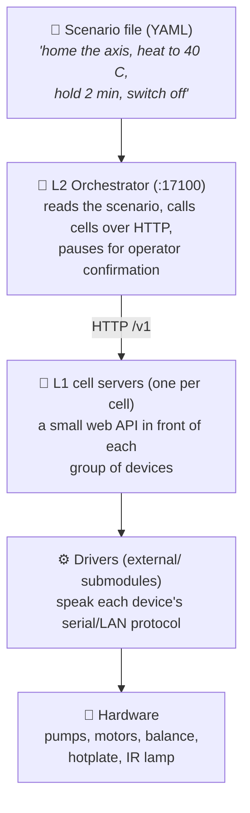
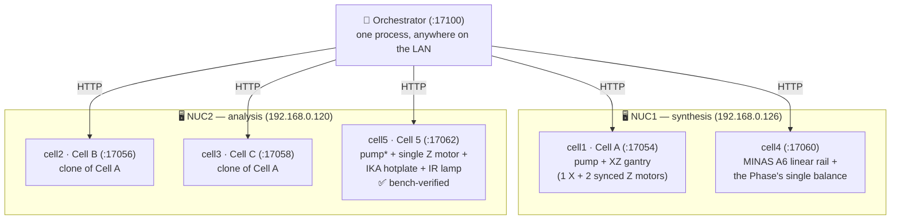
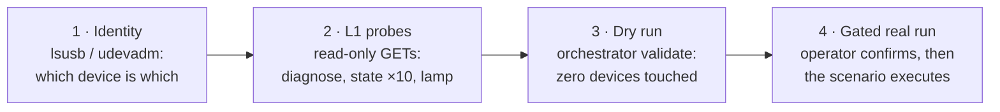
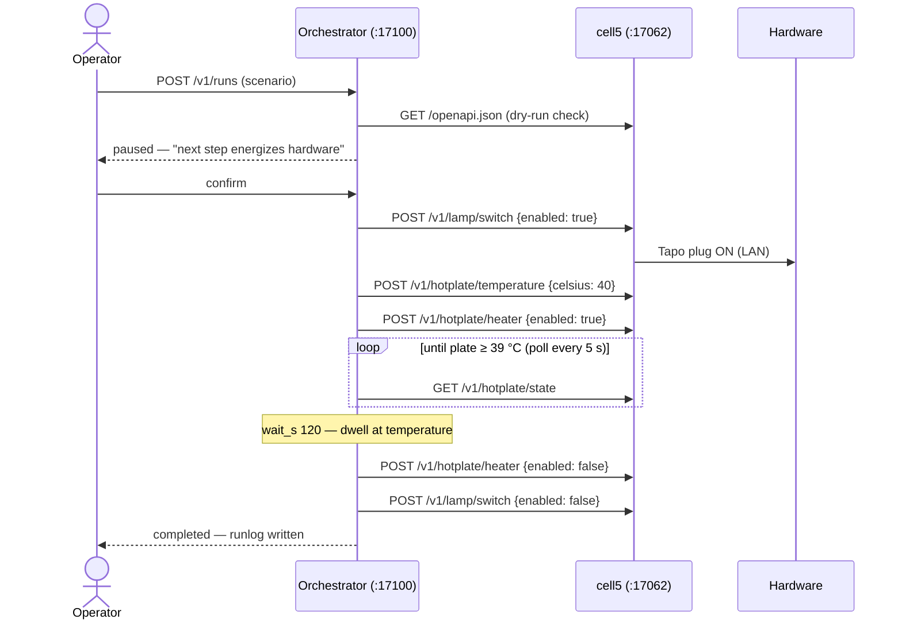

# InnoCORESDL

**A self-driving laboratory (SDL), one layer at a time.** This repository
teaches two lab computers (NUC1, NUC2) to run chemistry-lab hardware —
syringe pumps, motorized stages, a balance, a hotplate, an IR lamp — from
**scenario files** instead of a human clicking buttons.

If you have never seen a system like this, start with the picture:



Each layer only talks to the one below it. The orchestrator (**L2**) never
touches a serial port — it only speaks HTTP to the cell servers (**L1**),
and each cell server is the *single owner* of its devices' ports. That one
rule prevents two programs from fighting over the same cable.

---

## The bench (who runs what, and where)

Two NUCs share this one repository; only their config files differ.
Measured bench addresses (2026-07-28): **NUC1 = 192.168.0.126**,
**NUC2 = 192.168.0.120**.



\* Cell 5's syringe pump is not on the bench yet — its config simply omits
the `[pump]` table and the cell serves the other three devices, answering
HTTP 409 for pump requests.

### What each cell contains

A **cell** is one server owning one group of devices. Three shapes exist
(`cell/` has one Python class per shape); cells sharing a shape differ
only by config.

| Cell | NUC · port | Shape (class) | Devices inside | Status |
|---|---|---|---|---|
| **cell1** (Cell A) | NUC1 · 17054 | pump + gantry (`PumpGantryCell`) | Runze SY-01B syringe pump (`sy01b`, CH340 serial) · XZ gantry: 1× X + 2× **synchronized** Z MKS SERVO57D motors (`mks_motor`, FTDI/CAN, paired-Z interlock) | built, no bench run |
| **cell2** (Cell B) | NUC2 · 17056 | pump + gantry (`PumpGantryCell`) | identical clone of Cell A — different USB serials only | built, no bench run |
| **cell3** (Cell C) | NUC2 · 17058 | pump + gantry (`PumpGantryCell`) | identical clone of Cell A | built, no bench run |
| **cell4** | NUC1 · 17060 | balance + linear (`BalanceLinearCell`) | MINAS A6 linear rail (`LinearMotorController`, RS-485) · the Phase's **single** Entris-II balance (`entris_ii`, Sartorius CDC) that shuttles under cell1–3 to weigh each dispense | built, no bench run |
| **cell5** (Cell 5) | NUC2 · 17062 | pump + Z + thermal (`PumpZThermalCell`) | syringe pump (*not fitted yet* — optional `[pump]` table) · **one** MKS SERVO57D as a standalone Z axis (`mks_motor`, FTDI `NTB3EP5R`) · IKA RCT digital hotplate (`HotplateController`, STM32 VCP, direct USB port) · IR lamp on a Tapo P110M plug (`SmartPlugController`, LAN `192.168.0.237`) | ✅ **bench-verified** |

Special properties per cell worth remembering:

- **cell1–3**: the two Z motors always move together through the
  driver's paired-Z desync interlock — the highest-stakes subsystem.
- **cell4**: holds the *only* balance in the Phase, and its `stop()` is
  currently a no-op (GAP-1).
- **cell5**: the only cell that **heats** — uniquely, its `stop()` also
  kills the heater, the stirrer, and the lamp, not just motion.

All hardware drivers are git submodules under `external/` — see
[`external/SUBMODULES.md`](external/SUBMODULES.md).

---

## Status — what is actually proven

**Cell 5 (cell5) is bench-verified end to end** on NUC2 (2026-07-28): the
real hardware ran real scenarios through the full stack. The other cells
(cell1–4) are built and tested against a simulator, but have not moved
real hardware yet.

| Layer | Built | Verified | Not yet |
|---|---|---|---|
| L1 cells | all three shapes | **cell5 on real hardware** (Z + hotplate + lamp); others: imports, OpenAPI, shape inference, error mapping | cell1–4 physical behaviour |
| L1 `/v1` server | 26 routes | **cell5 live on NUC2:17062** — diagnose, 10/10 hotplate-state stress, lamp over LAN | cell1–4 bench bring-up |
| L2 orchestrator | registry, client, validator, engine (`wait_s`, `until:`), runlog, `/v1`, CLI | 45 tests; **three real Cell 5 runs completed** (below) | multi-cell / cross-NUC runs |
| Deployment | systemd template + Docker Compose | — | never deployed as a service (bench runs used the venv directly) |

### How Cell 5 was verified

Verification climbed a ladder — each rung earns the next. Nothing moves
until a human at the bench says so:



1. **Device identity** — Z motor = NTREX USB2CAN FTDI serial `NTB3EP5R`;
   hotplate = STM32 VCP `0483:5740` (auto-detected); IR lamp = Tapo P110M
   at `192.168.0.237` (a bare IP the cell resolves by itself).
2. **L1 probes** — `GET /v1/diagnose` (pump correctly reported absent),
   `hotplate/state` ×10 = **10/10** after the USB fix (see bench rules),
   `lamp/state` over the LAN.
3. **L2 dry run** — `python -m orchestrator validate` on every scenario:
   0 issues. The validator checks each step against the live cell's own
   OpenAPI, so typos die here, not mid-run.
4. **Gated real runs** — submitted through the orchestrator API; the
   first hazardous step of each run waited for explicit operator
   confirmation. Every run ended with the cell safe (heater off, lamp
   off, Z parked at home) and wrote a full runlog under `runs/`:

| Run | Result | What it proved |
|---|---|---|
| `cell5_lamp_heat_40c` | ✅ 13/13 steps | lamp switching, 40 °C setpoint, poll-until-temperature, verified shutdown; an abort mid-poll killed heater+lamp immediately |
| `cell5_z_cycles` (50 mm) | ✅ 17/17 steps | homing (15.5 s), three 0↔50 mm strokes (~3.6 s each), re-home |
| `cell5_final` | ✅ 21/21 steps | home → 400 mm → home, then lamp+heater to 40 °C, **2-minute dwell at temperature**, verified all-off |

What one of those runs looks like on the wire:



### Safety gaps you must know before touching hardware

| | |
|---|---|
| **GAP-9** | `POST /v1/stop` **cannot interrupt a command already in flight** — on any cell. It waits for the same lock the move holds; measured 4.2 s late on a 5 s move. L2's abort inherits this. (`until:` polls are the exception — they re-acquire the lock per read, so an abort cuts them off immediately, as the bench confirmed.) |
| **GAP-1** | cell4's `stop()` is a no-op even when it does run. |

**Consequence: the physical e-stop is the only stop.** Both gaps, with
their measurements and proposed fixes, are in
[`docs/L1_AUDIT.md`](docs/L1_AUDIT.md).

---

## Writing a scenario

A scenario is plain YAML — data, never code. Steps run top to bottom;
each step is either a cell call, a check, a hold, or a poll:

```yaml
name: my_first_scenario
params:
  hot_c: 40.0

steps:
  - id: lamp_on                    # call a cell action
    cell: cell5
    action: lamp/switch
    body: {enabled: true}
    save_as: lamp                  # keep the response as a variable

  - id: check_lamp                 # assert — no device is touched
    assert: "${lamp.is_on} == True"

  - id: wait_hot                   # poll a read-only GET until true
    cell: cell5
    action: hotplate/state
    method: GET
    until: "${result.plate_c} >= ${params.hot_c} - 1.0"
    poll_s: 5.0
    timeout_s: 900.0

  - id: hold                       # local timed hold (abort cuts it short)
    wait_s: 120.0
```

Things worth knowing before your first scenario:

- **`validate` first, always**: `python -m orchestrator validate my.yaml`
  checks every action and body field against the cell's live OpenAPI
  without sending a single device command.
- **`until:` is GET-only** — a command that moves or heats something must
  never sit inside a retry loop.
- **Temperature conditions need tolerance** (`>= target - 1.0`): the IKA
  hotplate reports whole degrees and regulates just *under* its setpoint,
  so an exact `>= 40.0` may never come true even when the panel shows 40.
- **Never name a field `on`** — YAML 1.1 turns a bare `on:` into a
  boolean before the orchestrator ever sees it. Heater and lamp take
  `enabled` instead.
- The first step that moves, heats, or energizes anything **pauses the
  run until the operator confirms**. There is no flag to skip this.

### The `/v1` action sets

A cell implements the sets its hardware has and answers 409 for the rest,
so a misdirected call is legible instead of a crash.

| Set | Routes | Cells |
|---|---|---|
| Discovery | `health`, `diagnose`, `status` | all |
| Balance | `balance/tare`, `balance/calibrate`, `balance/weight`, `balance/ambient` | cell4 |
| Pump | `pump/initialize`, `pump/valve`, `pump/aspirate`, `pump/dispense`, `pump/cycle` | cell1–3, cell5 |
| Gantry | `gantry/home`, `gantry/move` | cell1–3 |
| Linear | `linear/home`, `linear/move` | cell4 |
| ZStage | `zstage/home`, `zstage/move` | cell5 |
| Hotplate | `hotplate/state`, `hotplate/temperature`, `hotplate/heater`, `hotplate/speed`, `hotplate/stirrer` | cell5 |
| Lamp | `lamp/state`, `lamp/switch` | cell5 |
| Safety | `stop` | all (see GAP-9) |

L2 never hardcodes these — it reads each cell's `GET /openapi.json`,
which is why adding Cell 5's nine routes needed **zero** orchestrator
changes.

---

## Quick start

```bash
conda activate sdl                      # Python >= 3.12; on NUC2 use
                                        # the repo-local .venv instead
git submodule update --init --recursive
pip install -r requirements.txt

# L1 — one cell server (real hardware; shape auto-detected from the config)
cp server/nuc2/cell5.toml.example server/nuc2/cell5.toml
python -m server --config server/nuc2/cell5.toml         # :17062

# L2 — the orchestrator
cp orchestrator/config.toml.example orchestrator/config.toml
python -m orchestrator serve                             # :17100
python -m orchestrator validate scenarios/demo_cell5_final.yaml  # no devices
python -m orchestrator run      scenarios/demo_cell5_final.yaml --step-mode

# checks that need no hardware
pytest claude_test
ruff check cell/ server/ orchestrator/ claude_test/
```

Ports are per cell (SDLClaude `ARCHITECTURE.md`): cell1=17054,
cell2=17056, cell3=17058, cell4=17060, cell5=17062, orchestrator=17100.

---

## Layout

| Path | What |
|---|---|
| [`cell/`](cell/) | the cell layer: [`cell_protocol.py`](cell/cell_protocol.py) (interface + `CellError` hierarchy), [`pump_gantry_cell.py`](cell/pump_gantry_cell.py), [`balance_linear_cell.py`](cell/balance_linear_cell.py), [`pump_z_thermal_cell.py`](cell/pump_z_thermal_cell.py) |
| [`server/`](server/) | the L1 `/v1` server — `create_app` + routes + schemas + error mapping. `nuc1/`, `nuc2/` hold the per-NUC config examples |
| [`orchestrator/`](orchestrator/) | the L2 orchestrator: registry, cell client, scenario loader + dry-run validator, run engine, runlog, `/v1` API, CLI |
| [`scenarios/`](scenarios/) | scenario files — `demo_linear_move.yaml`, `demo_cell5_warmup.yaml`, and the bench-verified Cell 5 set: `demo_cell5_lamp_blink.yaml`, `demo_cell5_hotplate_30c.yaml`, `demo_cell5_z_cycles.yaml`, `demo_cell5_lamp_heat_40c.yaml`, `demo_cell5_final.yaml` |
| [`deploy/`](deploy/) | systemd template unit for the cells, Compose for the orchestrator, NUC setup guide |
| [`claude_test/`](claude_test/) | tests + the two bench tools (`preflight.py`, `smoke_l1.py`) |
| [`docs/`](docs/) | the L2 spec, the M0 audit, the bring-up runbook |
| [`external/`](external/) | every driver as a submodule |

---

## Next: connecting the rest of the hardware

**cell5 is done** (see Status); this applies to the remaining cells —
cell2/cell3 on NUC2, cell1/cell4 on NUC1 — plus cell5's missing syringe
pump (add the `[pump]` table back when it arrives). The runbook is
[`docs/L1_BRINGUP.md`](docs/L1_BRINGUP.md). In short:

1. **Collect what is still unknown** — `python claude_test/preflight.py`
   lists exactly which addresses are still `TBD`.
2. **Bring up one cell at a time** — start its server, prove identity
   with `GET /v1/diagnose`, then run the gated smoke test
   (`python claude_test/smoke_l1.py --base-url … --suite …`).
3. **Run the two contract probes** — `--suite concurrency` (A7) and
   `--suite stop` (A4; expected to fail — it measures GAP-9).
4. **Record everything in [`docs/L1_AUDIT.md`](docs/L1_AUDIT.md)** and
   replace guessed `timeout_s` values with measured durations.
5. **Then L2**: dry run → `--step-mode` → automatic.

### Roadmap

| Milestone | State |
|---|---|
| M0 — L1 adequacy audit | code review done; cell5 physical checks **done**, cell1–4 pending; 9 gaps recorded |
| M1 / M2 — registry + dry-run validator | done |
| M4 / M5 — engine, runlog, failure policies, pause/resume/abort | done; abort's stop broadcast exercised on the real cell5 |
| M6 — systemd + Docker + real `demo_linear_move` | artifacts written, **never deployed** |
| M7 — web scenario tab | not started; `web/` lives in git history |

Open questions, all recorded as gaps: **GAP-9 / GAP-1** (make the
software stop actually stop something), **GAP-8** (the per-cell lock
cannot model two cells sharing one physical workspace), and the two
robot arms (no L1 cell yet; `external/FR5Controller` is not packaged).
Milestone detail:
[`docs/L2_ORCHESTRATOR_SPEC.md`](docs/L2_ORCHESTRATOR_SPEC.md) §11.

---

## Bench notes

### Valve port gotcha (critical)

The pump's valve is a Runze M05 **Bi-pass** valve with only two fluid
states 90° apart. Firmware ports 1 & 3 land on the *same* state (and
2 & 4 on the other), so source and sink must be **90° apart, not 180°** —
on this bench the reservoir is port 2 and the tip is port 1. Verify with
the eye (which tube moves liquid), not the `?6` digit.
See [`LearnedPatterns.md`](LearnedPatterns.md) #1.

### Balance prerequisites (front panel, menu-only)

`DAT.REC = SBI`, `COM.OUTP = AUTO W/`, `STAB.RNG = V.FAST`; USB-C SBI
defaults 9600 / odd / 8 / 1. A `0x15` (NAK) reply means the balance is in
xBPI mode — wrong interface menu. The ambient filter comes from the cell
config, not the panel.

### Cell 5 specifics

The hotplate has a cell-level `max_celsius` ceiling in its config,
checked before the driver is called. The IR lamp's plug credentials live
in `external/SmartPlugController/secure.env`, written by the operator —
Claude Code does not read that file. Never run the hotplate driver's own
dashboard (`hotplate_controller/server.py`) while cell5 is up: one owner
per port.

Hard-won bench rules from the 2026-07-28 bring-up (details in
[`LearnedPatterns.md`](LearnedPatterns.md) #11–#14):

- **The hotplate's USB stays on a direct NUC port, never the shared
  hub.** Behind the hub its STM32 CDC interface wedged repeatedly and
  eventually dropped off the bus. Recovery when it wedges: unplug USB →
  hotplate off → wait 20 s → reconnect on the direct port → power on
  (the interface board is USB-powered — cycling the hotplate alone
  never resets it).
- ModemManager is disabled on NUC2 and
  `/etc/udev/rules.d/99-innocore-usb.rules` pins node permissions +
  `ID_MM_DEVICE_IGNORE` for the FTDI and STM32 VCP ids.
- **Temperature conditions need tolerance**: the RCT reports whole
  degrees and regulates just under the setpoint (panel shows 40 while
  serial says 39.0), so scenarios gate on `>= target - 1.0`.
- The `[pump]` table is optional in the cell5 config: without it the
  cell serves Z + hotplate + lamp and answers 409 on pump routes.
- A lamp `target` may be a bare IP unknown to the submodule's
  `device_list.md` — the cell synthesises the entry, so a re-DHCPed
  plug never needs an edit under `external/`.

### Field names must survive YAML

L2 scenarios are YAML, and YAML 1.1 resolves a bare `on:` **key** to a
boolean — so a field named `on` is unreachable from a scenario. The
heater/lamp routes take `enabled` instead.
See [`LearnedPatterns.md`](LearnedPatterns.md) #8.

---

## Dependencies

Python ≥ 3.12. The documented shared conda env **`sdl`** does not exist
on NUC2 — the bench runs there use a repo-local **`.venv`** instead
(created with `python3.12 -m venv --without-pip .venv` + get-pip.py,
because `python3-venv` is not installed and conda is blocked on a ToS
prompt; LearnedPatterns #10). The drivers come from the `external/`
submodules as editable installs, so a fresh checkout needs both:

```bash
git submodule update --init --recursive
pip install -r requirements.txt
```

The four packaged drivers import under their *package* names, not their
repo names: `sy01b`, `entris_ii`, `mks_motor`, `LinearMotorController`.
The hotplate and smart plug are still path-imported from `external/`.

## See also

- **SDLClaude `ARCHITECTURE.md`** — the SDL-wide architecture (Levels,
  Phases, the cell boundary rule, the port table). This repo is one Phase
  within it.
- [`docs/L2_ORCHESTRATOR_SPEC.md`](docs/L2_ORCHESTRATOR_SPEC.md) — the L2 design.
- [`docs/L1_AUDIT.md`](docs/L1_AUDIT.md) — the M0 audit, gap list, smoke-test record.
- [`docs/L1_BRINGUP.md`](docs/L1_BRINGUP.md) — the bench runbook.
- [`ADDING_A_CELL.md`](ADDING_A_CELL.md) — how to add hardware as a cell.
- [`LearnedPatterns.md`](LearnedPatterns.md) — every non-obvious problem
  hit here, with the rule it produced. Read it before debugging.
- [`CLAUDE.md`](CLAUDE.md) — conventions and environment for working here.
