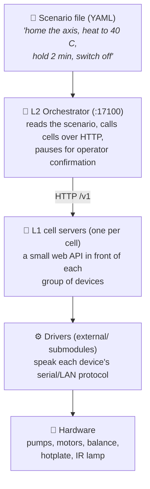
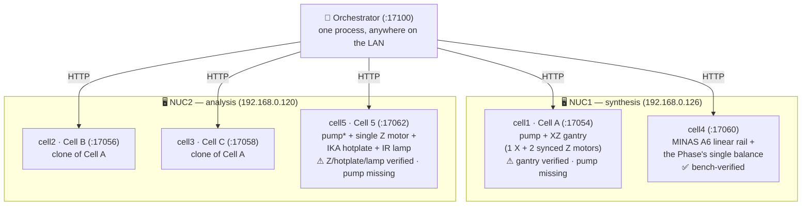
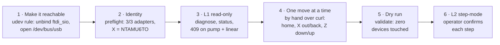
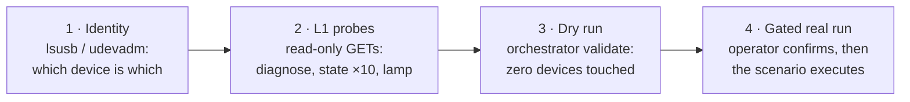
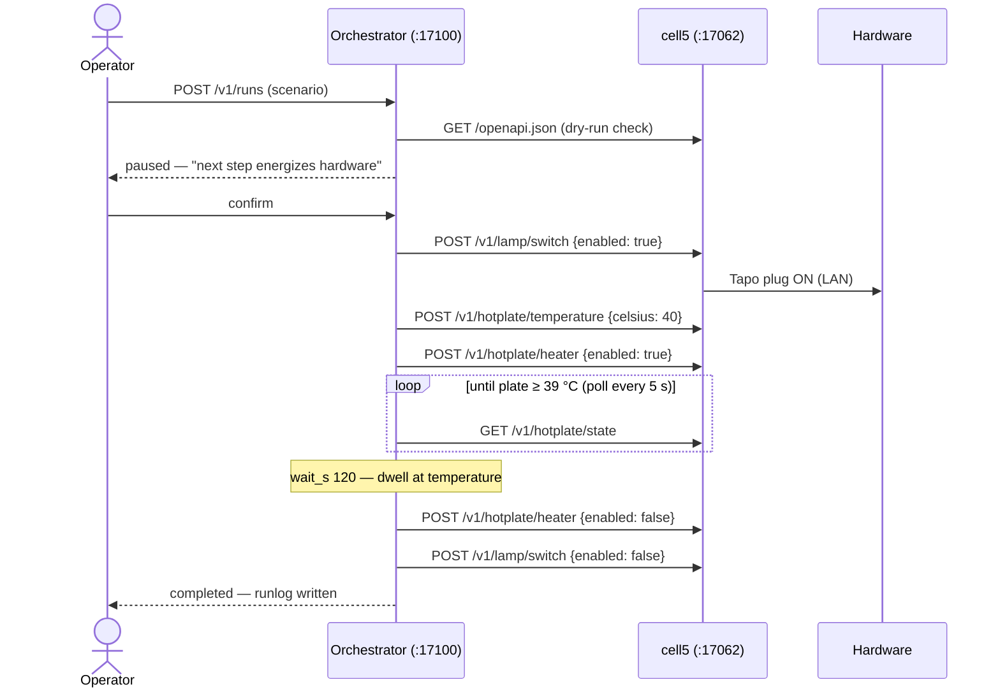

# InnoCORESDL

**A self-driving laboratory (SDL), one layer at a time.** This repository
teaches two lab computers (NUC1, NUC2) to run chemistry-lab hardware —
syringe pumps, motorized stages, a balance, a hotplate, an IR lamp — from
**scenario files** instead of a human clicking buttons.

If you have never seen a system like this, start with the picture:



Each layer only talks to the one below it. The orchestrator (**L2**) never
touches a serial port — it only speaks HTTP to the cell servers (**L1**),
and each cell server is the *single owner* of its devices' ports. That one
rule prevents two programs from fighting over the same cable.

---

## The bench (who runs what, and where)

Two NUCs share this one repository; only their config files differ.
Measured bench addresses (2026-07-28): **NUC1 = 192.168.0.126**,
**NUC2 = 192.168.0.120**.



\* Cell 5's syringe pump is not on the bench yet — its config simply omits
the `[pump]` table and the cell serves the other three devices, answering
HTTP 409 for pump requests.

### What each cell contains

A **cell** is one server owning one group of devices. Three shapes exist
(`cell/` has one Python class per shape); cells sharing a shape differ
only by config.

| Cell | NUC · port | Shape (class) | Devices inside | Status |
|---|---|---|---|---|
| **cell1** (Cell A) | NUC1 · 17054 | pump + gantry (`PumpGantryCell`) | Runze SY-01B syringe pump (*not on the bench* — optional `[pump]` table) · XZ gantry: 1× X (FTDI `NTAMU6TO`) + 2× **synchronized** Z MKS SERVO57D motors (`A10PUO5V` / `A10PUO5W`, `mks_motor`, FTDI/CAN, paired-Z interlock) | ⚠ **gantry bench-verified; cell incomplete — no pump** |
| **cell2** (Cell B) | NUC2 · 17056 | pump + gantry (`PumpGantryCell`) | identical clone of Cell A — different USB serials only | built, no bench run |
| **cell3** (Cell C) | NUC2 · 17058 | pump + gantry (`PumpGantryCell`) | identical clone of Cell A | built, no bench run |
| **cell4** | NUC1 · 17060 | balance + linear (`BalanceLinearCell`) | MINAS A6 linear rail (`LinearMotorController`, RS-485) · the Phase's **single** Entris-II balance (`entris_ii`, Sartorius CDC) that shuttles under cell1–3 to weigh each dispense | ✅ **bench-verified** |
| **cell5** (Cell 5) | NUC2 · 17062 | pump + Z + thermal (`PumpZThermalCell`) | syringe pump (*not fitted yet* — optional `[pump]` table) · **one** MKS SERVO57D as a standalone Z axis (`mks_motor`, FTDI `NTB3EP5R`) · IKA RCT digital hotplate (`HotplateController`, STM32 VCP, direct USB port) · IR lamp on a Tapo P110M plug (`SmartPlugController`, LAN `192.168.0.237`) | ⚠ **Z + hotplate + lamp bench-verified; cell incomplete — no pump** |

Special properties per cell worth remembering:

- **cell1–3**: the two Z motors always move together through the
  driver's paired-Z desync interlock — the highest-stakes subsystem.
- **cell4**: holds the *only* balance in the Phase, and its `stop()` is
  currently a no-op (GAP-1).
- **cell5**: the only cell that **heats** — uniquely, its `stop()` also
  kills the heater, the stirrer, and the lamp, not just motion.

All hardware drivers are git submodules under `external/` — see
[`external/SUBMODULES.md`](external/SUBMODULES.md).

---

## Status — what is actually proven

**One cell is complete; two more run everything they physically have.**
All three were brought up on 2026-07-28, each completing real scenarios
through the full L1 + L2 stack.

**Only cell4 is a finished cell** — its shape has no pump by design, so
nothing is missing from it. cell1 and cell5 both define a syringe pump
that is **not on the bench**. What is proven there is every device they
actually have: cell1's XZ gantry, and cell5's Z axis, hotplate and lamp.
Neither cell is verified *as a cell*, and their pump paths have never run
on hardware. cell2–3 are built and unrun; they are clones of cell1 and
need only their own adapter serials.

| Layer | State |
|---|---|
| L1 cell5 (Z + hotplate + lamp) | those three devices **bench-verified on NUC2** — see the ladder below. **Pump not fitted: cell incomplete** |
| L1 cell4 (balance + linear rail) | **complete and bench-verified on NUC1** — identity, status, tare, weigh, home, move. The only cell with no missing device |
| L1 cell1 (XZ gantry) | gantry **bench-verified on NUC1** — 4/4 runs, 116 steps, 0 failures. **Pump not fitted: cell incomplete** |
| L1 cell2–3 | code complete, no bench run (clones of cell1) |
| L1 `/v1` server | 26 routes, serving cell1, cell4 and cell5 against real devices |
| L2 orchestrator | registry, client, validator, engine (`wait_s`, `until:`), runlog, `/v1`, CLI — **79 tests**, plus real runs on three cells |
| Deployment | systemd template + Docker Compose, **never deployed as a service** (bench runs used the venv directly) |

### How cell4 was verified

`demo_weigh_at_position.yaml` completed **15/15** (run
`20260728T111725Z`): zero the balance, carry it 50 mm, weigh a vial at
25.7424 g, return. What the run settled:

| Question | Answer |
|---|---|
| Can cell4 weigh somewhere other than where it settles? | **Yes.** Carrying the balance 50 mm and back shifted a 25.7 g reading by **0.0039 g** |
| How fast is a settled weight read? | ~1.2 s (stream 2.6 lines/s, consecutive-3 spread median 0.0005 g) |
| How fast is a 50 mm move? | ~6 s |
| Is the RS485 link reliable? | **No** — see the EMI note under Bench notes. Reads survive it; moves abort on it, deliberately |

Every number there is a bench measurement. The 79 tests touch no
hardware, which is the point: they cannot tell you any of this.

### How cell1's gantry was verified (the gantry only — cell1 has no pump)

The same ladder as Cell 5, with two extra rungs the gantry needed — the
adapters had to be made reachable at all, and each motion *class* was
driven by hand before any scenario was allowed to chain them:



Rung 4 mattered most. Homing was commanded before anything else, then a
single 50 mm X move — that one move was the test of whether X's
`coord_invert` was right, because the wrong sign drives the axis into its
own limit switch instead of away from it. Only after each motion class had
been watched individually was L2 allowed to run them in sequence.

Two scenarios, **four runs, 116 steps, zero failures** — the stair run
three times on purpose, because one run cannot calibrate a tolerance.

| Run | Scenario | Steps | Result |
|---|---|---|---|
| `20260728T115546Z` | `demo_gantry_step` — X out/back 50 mm, then Z | 23 | ✅ |
| `20260728T115738Z` | `demo_gantry_stair` — origin → (50,50) → (100,100) → (150,150) → origin | 31 | ✅ |
| `20260728T120806Z` | `demo_gantry_stair` (repeat) | 31 | ✅ |
| `20260728T120935Z` | `demo_gantry_stair` (repeat) | 31 | ✅ |

| Question | Answer |
|---|---|
| Does a commanded 50 mm actually travel 50 mm? | **Yes** — worst increment error **0.094 mm** over 20 waypoints |
| How close does an axis land? | worst residual **0.145 mm** immediately after the move; `/v1/status` reads the same waypoint within **0.001 mm** once the servo settles |
| Do the paired Z motors stay together? | **Yes** — worst spread **0.020 mm**, including at 150 mm depth |
| How repeatable is homing? | X lands on **0.0006 mm every time**, identical across all three runs |
| How long? | home 5.7 s; the three stair waypoints 3.4 / 5.2 / 7.1 s (duration scales with travel, since Z fully retracts before each X traverse) |

**The gantry path is never diagonal.** `move_gantry` runs up → X → down
whenever the X target changes, so Z retracts fully between waypoints and
the head never traverses X while lowered.

**A `200 OK` from `gantry/move` means the encoder was read**, not that a
command was accepted — the cell confirms every move by reading the axis
back and raises if it did not arrive, could not be read, or if the Z pair
ended apart. That check exists because the opposite was true earlier the
same day: the cell returned the position it had been *asked* for, so an
unpowered gantry would have answered `200 OK` with `x_mm: 50.0`
(LearnedPatterns #24).

**What the scenarios assert is the distance travelled, not the endpoint.**
Each check subtracts the previous waypoint's encoder reading from the
current one and requires the difference to be 50 mm. An axis that was
already at the target — or one that never moved at all — passes an
endpoint check and fails this one. It is also the more stable measurement:
one run carried a persistent +0.145 mm X offset between waypoints while
its step-to-step increment stayed within 0.001 mm of 50, because a
constant offset cancels under subtraction (LearnedPatterns #33).

Every waypoint is read **twice** — once from `gantry/move`'s response,
once from a separate `GET /v1/status` — and the two differ by up to
0.145 mm as the servo settles between them. That disagreement is the
point: under the bug above, both would have returned the same cached
number and agreed to every decimal. Exact agreement between two supposedly
independent reads is the thing to distrust (LearnedPatterns #34).

Four defects surfaced during this bring-up, none of them from a failed
run: a documented adapter serial that was not on the bench (#22), a
pre-flight that reported a permission error as a missing device (#23), the
fabricated position above (#24), and a schema bound that rejected the
acceleration value both upstream reference scripts use — which also
exposed that the dry run never checked numeric bounds at all (#25). The
full account is [issue #14](https://github.com/coport-uni/InnoCORESDL_Sungwoo/issues/14).

### How Cell 5's three fitted devices were verified (no pump)

Verification climbed a ladder — each rung earns the next. Nothing moves
until a human at the bench says so:



1. **Device identity** — Z motor = NTREX USB2CAN FTDI serial `NTB3EP5R`;
   hotplate = STM32 VCP `0483:5740` (auto-detected); IR lamp = Tapo P110M
   at `192.168.0.237` (a bare IP the cell resolves by itself).
2. **L1 probes** — `GET /v1/diagnose` (pump correctly reported absent),
   `hotplate/state` ×10 = **10/10** after the USB fix (see bench rules),
   `lamp/state` over the LAN.
3. **L2 dry run** — `python -m orchestrator validate` on every scenario:
   0 issues. The validator checks each step against the live cell's own
   OpenAPI, so typos die here, not mid-run.
4. **Gated real runs** — submitted through the orchestrator API; the
   first hazardous step of each run waited for explicit operator
   confirmation. Every run ended with the cell safe (heater off, lamp
   off, Z parked at home) and wrote a full runlog under `runs/`:

| Run | Result | What it proved |
|---|---|---|
| `cell5_lamp_heat_40c` | ✅ 13/13 steps | lamp switching, 40 °C setpoint, poll-until-temperature, verified shutdown; an abort mid-poll killed heater+lamp immediately |
| `cell5_z_cycles` (50 mm) | ✅ 17/17 steps | homing (15.5 s), three 0↔50 mm strokes (~3.6 s each), re-home |
| `cell5_final` | ✅ 21/21 steps | home → 400 mm → home, then lamp+heater to 40 °C, **2-minute dwell at temperature**, verified all-off |

What one of those runs looks like on the wire:



### Safety gaps you must know before touching hardware

| | |
|---|---|
| **GAP-9** | `POST /v1/stop` **cannot interrupt a command already in flight** — on any cell. It waits for the same lock the move holds; measured 4.2 s late on a 5 s move. L2's abort inherits this. (`until:` polls are the exception — they re-acquire the lock per read, so an abort cuts them off immediately, as the bench confirmed.) |
| **GAP-1** | cell4's `stop()` is a no-op even when it does run. |
| **No alarm visibility** | the MINAS driver cannot read or clear an amp alarm, so `diagnose()` reports `stage.ok: true` on an amp that has tripped and de-energised its servo. The front panel is the only alarm indicator ([#15](https://github.com/coport-uni/InnoCORESDL_Sungwoo/issues/15)). |

**Consequence: the physical e-stop is the only stop.** Both gaps, with
their measurements and proposed fixes, are in
[`docs/L1_AUDIT.md`](docs/L1_AUDIT.md).

### Two known faults deliberately left open

Both are understood, reproduced and documented; neither is being fixed
yet, and running the bench with them open is a decision rather than an
oversight.

**[#13](https://github.com/coport-uni/InnoCORESDL_Sungwoo/issues/13) — the
amp jams its own RS485 link.** Deferred to a later bench session, because
the fix is electrical (grounding and termination, see the note below) and
not something software can close. Meanwhile the link is *usable*, not
fixed: reads are absorbed by the driver's reconnect, and a move that
straddles a drop is stopped and failed rather than resumed. So a run can
still abort partway on a link drop. Re-run it; that is the abort rule
working.

**[#15](https://github.com/coport-uni/InnoCORESDL_Sungwoo/issues/15) — the
driver cannot read an amp alarm.** Left open on purpose: developing the
alarm read means *reproducing* an alarm, and the only alarm this bench
knows how to raise is Err16.0 — driving the rail into its mechanical stop
until the motor overloads. That is not a thing to do repeatedly to a servo
for the sake of a nicer error message.

The operator carries this one instead. **If moves stop having any effect
while the amp still answers `/v1/diagnose` normally, read the amp's front
panel** — that combination means an alarm, and software will keep
reporting `stage.ok: true` throughout. Recovery is in the bench note
below. If the alarm read is implemented later, decode the response against
the manual rather than by provoking the amp.

---

## Writing a scenario

A scenario is plain YAML — data, never code. Steps run top to bottom;
each step is either a cell call, a check, a hold, or a poll:

```yaml
name: my_first_scenario
params:
  hot_c: 40.0

steps:
  - id: lamp_on                    # call a cell action
    cell: cell5
    action: lamp/switch
    body: {enabled: true}
    save_as: lamp                  # keep the response as a variable

  - id: check_lamp                 # assert — no device is touched
    assert: "${lamp.is_on} == True"

  - id: wait_hot                   # poll a read-only GET until true
    cell: cell5
    action: hotplate/state
    method: GET
    until: "${result.plate_c} >= ${params.hot_c} - 1.0"
    poll_s: 5.0
    timeout_s: 900.0

  - id: hold                       # local timed hold (abort cuts it short)
    wait_s: 120.0
```

Things worth knowing before your first scenario:

- **`validate` first, always**: `python -m orchestrator validate my.yaml`
  checks every action and body field against the cell's live OpenAPI
  without sending a single device command.
- **`until:` is GET-only** — a command that moves or heats something must
  never sit inside a retry loop.
- **Temperature conditions need tolerance** (`>= target - 1.0`): the IKA
  hotplate reports whole degrees and regulates just *under* its setpoint,
  so an exact `>= 40.0` may never come true even when the panel shows 40.
- **Never name a field `on`** — YAML 1.1 turns a bare `on:` into a
  boolean before the orchestrator ever sees it. Heater and lamp take
  `enabled` instead.
- The first step that moves, heats, or energizes anything **pauses the
  run until the operator confirms**. There is no flag to skip this.

### The `/v1` action sets

A cell implements the sets its hardware has and answers 409 for the rest,
so a misdirected call is legible instead of a crash.

| Set | Routes | Cells |
|---|---|---|
| Discovery | `health`, `diagnose`, `status` | all |
| Balance | `balance/tare`, `balance/calibrate`, `balance/weight`, `balance/ambient` | cell4 |
| Pump | `pump/initialize`, `pump/valve`, `pump/aspirate`, `pump/dispense`, `pump/cycle` | cell1–3, cell5 |
| Gantry | `gantry/home`, `gantry/move` | cell1–3 |
| Linear | `linear/home`, `linear/move` | cell4 |
| ZStage | `zstage/home`, `zstage/move` | cell5 |
| Hotplate | `hotplate/state`, `hotplate/temperature`, `hotplate/heater`, `hotplate/speed`, `hotplate/stirrer` | cell5 |
| Lamp | `lamp/state`, `lamp/switch` | cell5 |
| Safety | `stop` | all (see GAP-9) |

L2 never hardcodes these — it reads each cell's `GET /openapi.json`,
which is why adding Cell 5's nine routes needed **zero** orchestrator
changes.

---

## Quick start

```bash
conda activate sdl                      # Python >= 3.12; on NUC2 use
                                        # the repo-local .venv instead
git submodule update --init --recursive
pip install -r requirements.txt

# L1 — one cell server (real hardware; shape auto-detected from the config)
cp server/nuc2/cell5.toml.example server/nuc2/cell5.toml
python -m server --config server/nuc2/cell5.toml         # :17062

# L2 — the orchestrator
cp orchestrator/config.toml.example orchestrator/config.toml
python -m orchestrator serve                             # :17100
python -m orchestrator validate scenarios/demo_weigh_at_position.yaml  # no devices
python -m orchestrator run      scenarios/demo_weigh_at_position.yaml  # cell4
python -m orchestrator run      scenarios/demo_cell5_final.yaml        # cell5

# checks that need no hardware
pytest claude_test
ruff check cell/ server/ orchestrator/ claude_test/
```

Runs stop where a human is needed and nowhere else: once before the first
motion step (`confirm_first_motion`, CLAUDE.md folder rule #3) and once at
any step carrying a `pause:` — `demo_weigh_at_position.yaml` uses one to
have the vial loaded. `--step-mode` still exists and stops after *every*
step; prefer it only when debugging, since thirteen prompts of which one
matters is how an operator stops reading them.

Ports are per cell (SDLClaude `ARCHITECTURE.md`): cell1=17054,
cell2=17056, cell3=17058, cell4=17060, cell5=17062, orchestrator=17100.

---

## Layout

| Path | What |
|---|---|
| [`cell/`](cell/) | the cell layer: [`cell_protocol.py`](cell/cell_protocol.py) (interface + `CellError` hierarchy), [`pump_gantry_cell.py`](cell/pump_gantry_cell.py), [`balance_linear_cell.py`](cell/balance_linear_cell.py), [`pump_z_thermal_cell.py`](cell/pump_z_thermal_cell.py) |
| [`server/`](server/) | the L1 `/v1` server — `create_app` + routes + schemas + error mapping. `nuc1/`, `nuc2/` hold the per-NUC config examples |
| [`orchestrator/`](orchestrator/) | the L2 orchestrator: registry, cell client, scenario loader + dry-run validator, run engine, runlog, `/v1` API, CLI |
| [`scenarios/`](scenarios/) | scenario files — the bench-run cell1 gantry pair `demo_gantry_step.yaml` / `demo_gantry_stair.yaml`, the bench-verified cell4 pair `demo_linear_move.yaml` / `demo_weigh_at_position.yaml`, `demo_cell5_warmup.yaml`, and the bench-verified Cell 5 set: `demo_cell5_lamp_blink.yaml`, `demo_cell5_hotplate_30c.yaml`, `demo_cell5_z_cycles.yaml`, `demo_cell5_lamp_heat_40c.yaml`, `demo_cell5_final.yaml` |
| [`deploy/`](deploy/) | systemd template unit for the cells, Compose for the orchestrator, NUC setup guide |
| [`claude_test/`](claude_test/) | tests + the two bench tools (`preflight.py`, `smoke_l1.py`) |
| [`docs/`](docs/) | the L2 spec, the M0 audit, the bring-up runbook |
| [`external/`](external/) | every driver as a submodule |

---

## Next: connecting the rest of the hardware

**cell4 is done; cell1 and cell5 run every device they have but are
still missing their syringe pumps** (see Status). What remains:
cell2/cell3 on NUC2 — clones of cell1, needing only their own FTDI
adapter serials — and fitting the two pumps, which is the step that would
make cell1 and cell5 complete cells rather than partially-populated ones.
Restore the `[pump]` table when a pump arrives; the pump paths are coded
and unit-tested but have never touched hardware in either cell. Read
adapter serials off the bus, never from a doc (LearnedPatterns #22). The
runbook is
[`docs/L1_BRINGUP.md`](docs/L1_BRINGUP.md). In short:

1. **Collect what is still unknown** — `python claude_test/preflight.py`
   lists exactly which addresses are still `TBD`.
2. **Bring up one cell at a time** — start its server, prove identity
   with `GET /v1/diagnose`, then run the gated smoke test
   (`python claude_test/smoke_l1.py --base-url … --suite …`).
3. **Run the two contract probes** — `--suite concurrency` (A7) and
   `--suite stop` (A4; expected to fail — it measures GAP-9).
4. **Record everything in [`docs/L1_AUDIT.md`](docs/L1_AUDIT.md)** and
   replace guessed `timeout_s` values with measured durations.
5. **Then L2**: dry run → `--step-mode` → automatic.

### Roadmap

| Milestone | State |
|---|---|
| M0 — L1 adequacy audit | code review done; **cell4 complete, cell1 + cell5 checked for every fitted device** (both still pump-less), cell2–3 pending; 9 gaps recorded |
| M1 / M2 — registry + dry-run validator | done |
| M4 / M5 — engine, runlog, failure policies, pause/resume/abort | done; exercised by real cell4 **and cell5** runs |
| M6 — systemd + Docker + real demo scenarios | **cell1's two demos, cell4's two and cell5's four all run on hardware** — none of them exercises a pump, since neither pump-bearing cell has one; systemd/Compose artifacts still never deployed |
| M7 — web scenario tab | not started; `web/` was removed with the other pre-L2 work and lives in git history |

Open questions that shape the next phase, all recorded as gaps:

- **GAP-9 / GAP-1** — make the software stop actually stop something. Needs
  an L1 change plus driver work; user approval required.
- **#13 (RS485/EMI)** — deferred to a later bench session; the fix is
  electrical, and the software already limits the damage (reads reconnect,
  moves abort).
- **#15 (amp alarm read)** — deferred deliberately, because building it
  means repeatedly overloading a servo to reproduce the alarm. Documented
  as an operator check instead.
- **GAP-8** — the L2 lock is per cell, so two cells sharing one physical
  workspace can still collide inside a `parallel` block. This must be solved
  before a robot arm reaches into another cell's frame.
- **Robots** — the two arms have no L1 cell yet. `ADDING_A_CELL.md` says they
  fit the cell format as an `arm` action set of discrete named trajectories;
  the blocker is that `external/FR5Controller` is not packaged.

Milestone detail is in
[`docs/L2_ORCHESTRATOR_SPEC.md`](docs/L2_ORCHESTRATOR_SPEC.md) §11.

---

## Bench notes

### Valve port gotcha (critical)

The pump's valve is a Runze M05 **Bi-pass** valve with only two fluid
states 90° apart. Firmware ports 1 & 3 land on the *same* state (and
2 & 4 on the other), so source and sink must be **90° apart, not 180°** —
on this bench the reservoir is port 2 and the tip is port 1. Verify with
the eye (which tube moves liquid), not the `?6` digit.
See [`LearnedPatterns.md`](LearnedPatterns.md) #1.

### Balance prerequisites (front panel, menu-only)

`DAT.REC = SBI`, `COM.OUTP = AUTO.W/O`, `STAB.RNG = V.FAST`; USB-C SBI
defaults 9600 / odd / 8 / 1. (`AUTO W/` — *with* stability — only speaks
once the balance calls itself settled, which on this bench it never did:
20 s of listening captured zero lines. `AUTO.W/O` streams unconditionally
and the driver judges settling, as above.) The PC lead is an ordered
accessory, `YCC-USB-C-A`; a charge-only cable produces **no kernel events
at all**, which is its own diagnosis (LearnedPatterns #11). A `0x15` (NAK) reply means the balance is in
xBPI mode — wrong interface menu. The ambient filter comes from the cell
config, not the panel.

### Cell 5 specifics

The hotplate has a cell-level `max_celsius` ceiling in its config,
checked before the driver is called. The IR lamp's plug credentials live
in `external/SmartPlugController/secure.env`, written by the operator —
Claude Code does not read that file. Never run the hotplate driver's own
dashboard (`hotplate_controller/server.py`) while cell5 is up: one owner
per port.

Hard-won bench rules from the 2026-07-28 bring-up (details in
[`LearnedPatterns.md`](LearnedPatterns.md) #11–#14):

- **The hotplate's USB stays on a direct NUC port, never the shared
  hub.** Behind the hub its STM32 CDC interface wedged repeatedly and
  eventually dropped off the bus. Recovery when it wedges: unplug USB →
  hotplate off → wait 20 s → reconnect on the direct port → power on
  (the interface board is USB-powered — cycling the hotplate alone
  never resets it).
- ModemManager is disabled on NUC2 and
  `/etc/udev/rules.d/99-innocore-usb.rules` pins node permissions +
  `ID_MM_DEVICE_IGNORE` for the FTDI and STM32 VCP ids.
- **Temperature conditions need tolerance**: the RCT reports whole
  degrees and regulates just under the setpoint (panel shows 40 while
  serial says 39.0), so scenarios gate on `>= target - 1.0`.
- The `[pump]` table is optional in the cell5 config: without it the
  cell serves Z + hotplate + lamp and answers 409 on pump routes.
- A lamp `target` may be a bare IP unknown to the submodule's
  `device_list.md` — the cell synthesises the entry, so a re-DHCPed
  plug never needs an edit under `external/`.

### The XZ gantry needs a udev rule before it will open at all

`mks_motor` drives the USB2CAN adapters through **pyftdi/libusb**, but the
kernel auto-binds `ftdi_sio` to every FTDI chip on plug and `/dev/bus/usb`
nodes are root-only. Until the rule is installed, enumeration fails with
*"The device has no langid (permission issue…)"* and the cell cannot open
the gantry. The driver's `release_ftdi_sio()` cannot fix it from an
unprivileged process — unbinding needs root. Once per NUC
(`external/ESP32S3BOX3MotorController/SETUP_UBUNTU.md` §1):

```bash
sudo tee /etc/udev/rules.d/99-ftdi-usb2can.rules >/dev/null <<'EOF'
SUBSYSTEM=="usb", ATTRS{idVendor}=="0403", ATTRS{idProduct}=="6001", \
    MODE="0666", \
    RUN+="/bin/sh -c 'echo $kernel > /sys/bus/usb/drivers/ftdi_sio/unbind 2>/dev/null'"
EOF
sudo udevadm control --reload-rules && sudo udevadm trigger
```

**`preflight.py` reports these adapters as "not attached" while
`ftdi_sio` still holds them** — that is the same permission failure, not a
missing adapter, and it is why the pump and balance resolve in the same
run while the gantry does not (they go through pyserial, which only needs
`dialout`). See [`LearnedPatterns.md`](LearnedPatterns.md) #23.

Adapter serials must be read off the bus, not copied from documentation:
this bench's X was documented as `NTAM63XD` and is actually `NTAMU6TO`,
while both Z serials in the docs were correct — which is exactly what one
swapped adapter looks like. `open_xz` raises on a serial it cannot find,
so the server dies at startup. Read them with
`external/ESP32S3BOX3MotorController/CAN2USBAdapterDeviceRecognition.py`.
See [`LearnedPatterns.md`](LearnedPatterns.md) #22.

### The rail must not park on 0 mm (critical)

cell4's 0 mm encoder origin sits **on the mechanical end stop**, and the
closed loop coasts 1.5–1.8 mm past its target. Homing to 0 therefore
drives the carriage into the stop and holds it there until the amp trips
**Err16.0** (motor overload) and de-energises the servo — after which every
move displaces 0 mm while the amp still answers serial normally.

This is the alarm referred to under "known faults left open": while it is
latched, `/v1/diagnose` keeps answering `stage.ok: true` and every move
reports a stall, so the front panel is the only place the truth appears.

The rail parks at `home_mm` (default **5.0 mm**) in the cell config, and
both scenarios use a matching `home_mm` param. Keep the two in step, and
keep the clearance well above the coast distance. Recovery is: pull the
rail clear of the stop **by hand first** (the servo is off, so it moves
freely), *then* clear the alarm — clearing while still pressed re-trips it.
See [`LearnedPatterns.md`](LearnedPatterns.md) #27 and issue
[#15](https://github.com/coport-uni/InnoCORESDL_Sungwoo/issues/15).

### The servo amp jams its own RS485 link

The MINAS amp couples conducted noise back through the RS485 pair, which
knocks the Moxa UPort off USB every few seconds. Measured: amp off → 0
re-enumerations per 40 s; amp on → 15; amp on with the RS485 cable
unplugged → 0. It is **conducted, not radiated**, so a shielded USB cable
and ferrites on the USB side are the wrong purchase — the fix is on the
RS485 side (SG run between the ends, 120 Ω termination once per end,
shield grounded at one end only), and only then an isolated adapter.

The driver absorbs this for **reads** — it reopens the port and 959/959
position reads landed across 18 re-enumerations. It deliberately does
**not** absorb it for moves: a move that straddles a reconnect is stopped
and failed, because the alternative is a rail travelling on stale position
data with no software stop. So while the link is bad, moves keep aborting;
that is the design, not a regression.
See [`LearnedPatterns.md`](LearnedPatterns.md) #20, #26 and issue
[#13](https://github.com/coport-uni/InnoCORESDL_Sungwoo/issues/13).

### Balance settling is judged in software

The bench runs `COM.OUTP = AUTO.W/O` — the balance streams whether or not
it calls itself stable — and the driver accepts a value once three
consecutive readings agree within 0.002 g. That tolerance is measured, not
guessed: consecutive-3 spread runs median 0.0005 g, p90 0.0009 g. A
healthy settle costs ~1.2 s against a 60 s budget, so **hitting the
timeout means the stream went silent, not that the balance was slow.**

### Field names must survive YAML

L2 scenarios are YAML, and YAML 1.1 resolves a bare `on:` **key** to a
boolean — so a field named `on` is unreachable from a scenario. The
heater/lamp routes take `enabled` instead.
See [`LearnedPatterns.md`](LearnedPatterns.md) #8.

---

## Dependencies

Python ≥ 3.12. The documented shared conda env **`sdl`** does not exist
on NUC2 — the bench runs there use a repo-local **`.venv`** instead
(created with `python3.12 -m venv --without-pip .venv` + get-pip.py,
because `python3-venv` is not installed and conda is blocked on a ToS
prompt; LearnedPatterns #28). The drivers come from the `external/`
submodules as editable installs, so a fresh checkout needs both:

```bash
git submodule update --init --recursive
pip install -r requirements.txt
```

The four packaged drivers import under their *package* names, not their
repo names: `sy01b`, `entris_ii`, `mks_motor`, `LinearMotorController`.
The hotplate and smart plug are still path-imported from `external/`.

## See also

- **SDLClaude `ARCHITECTURE.md`** — the SDL-wide architecture (Levels,
  Phases, the cell boundary rule, the port table). This repo is one Phase
  within it.
- [`docs/L2_ORCHESTRATOR_SPEC.md`](docs/L2_ORCHESTRATOR_SPEC.md) — the L2 design.
- [`docs/L1_AUDIT.md`](docs/L1_AUDIT.md) — the M0 audit, gap list, smoke-test record.
- [`docs/L1_BRINGUP.md`](docs/L1_BRINGUP.md) — the bench runbook.
- [`ADDING_A_CELL.md`](ADDING_A_CELL.md) — how to add hardware as a cell.
- [`LearnedPatterns.md`](LearnedPatterns.md) — every non-obvious problem
  hit here, with the rule it produced. Read it before debugging.
- [`CLAUDE.md`](CLAUDE.md) — conventions and environment for working here.
