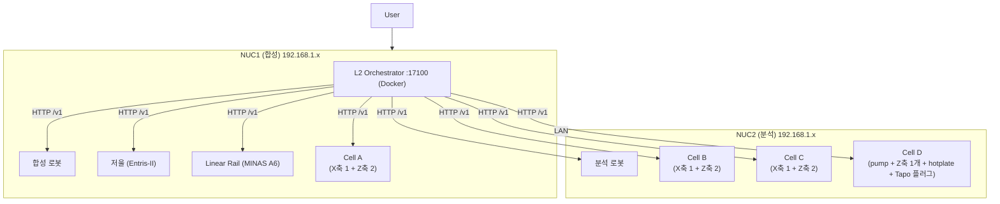
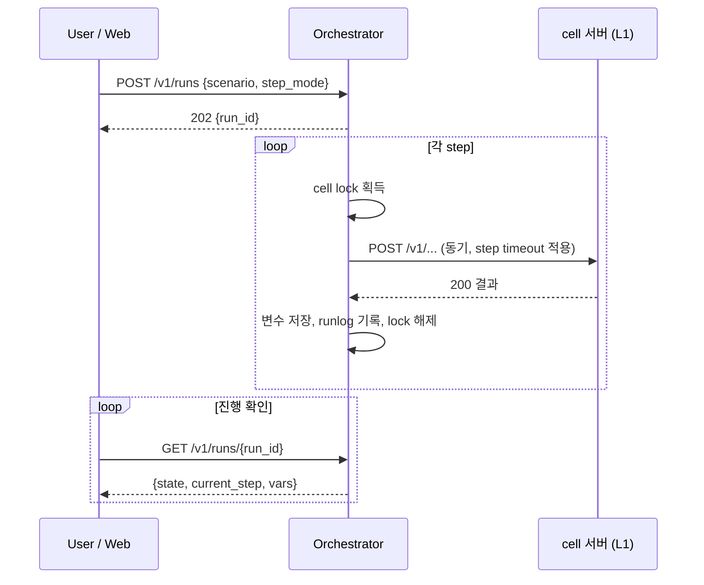
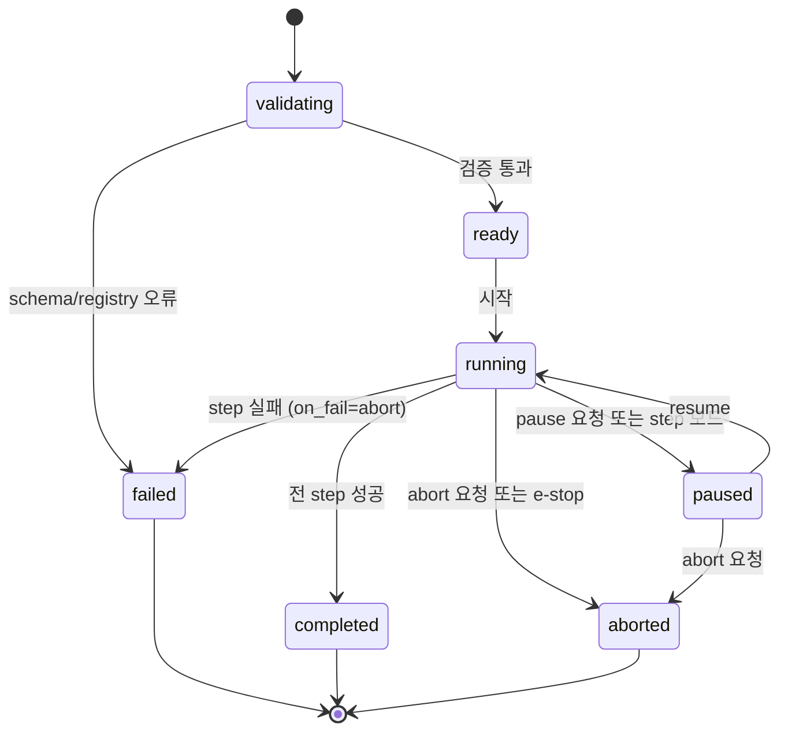
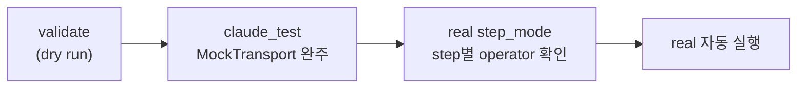
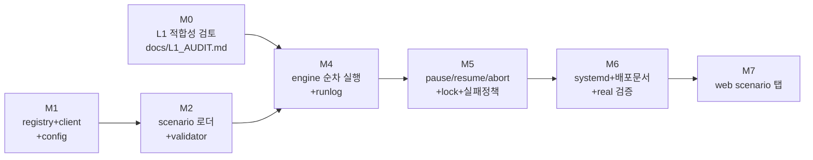

# L2 Orchestrator 개발 사양서

대상 저장소: `coport-uni/InnoCORESDL_Sungwoo`
문서 버전: v1.1 (2026-07-27)
독자: 이 저장소에서 작업하는 Claude Code

v1.0 대비 변경 (구현 반영): **Cell D (cell5)가 구현되었다.**
`cell/pump_z_thermal_cell.py` (`PumpZThermalCell`)와 신규 action set 3종
(`zstage/*`, `hotplate/*`, `lamp/*`), `server/nuc2/cell5.toml.example`,
시나리오 `scenarios/demo_cell_d_warmup.yaml`이 추가되었고
`[cells.cell5]`가 orchestrator config에 등록되었다. 그 과정에서 확정된
사항 셋:

1. **단일 Z축은 gantry action set을 재사용하지 않는다.** gantry는 X
   target을 요구하므로 Cell D에 맞지 않는다 (`ADDING_A_CELL.md`의 "새
   motion family는 새 action set" 규칙). 다만 모터 구동은 여전히
   드라이버의 group helper (`home_sync`/`move_sync`/`stop_group_hard`)를
   one-motor group으로 호출한다 — 쌍 Z 인터록이 아니라 limit-drop 흡수가
   그 helper들의 본질이기 때문이다.
2. **필드명 `on` 금지.** YAML 1.1이 키 `on:`을 불리언으로 해석해
   시나리오에서 지정할 수 없다. heater/stirrer/lamp는 `enabled`를 쓴다
   (`LearnedPatterns.md` #8).
3. **6.4절의 확인 게이트는 "모션"이 아니라 "하드웨어 작용"이 기준이다.**
   가열체와 램프도 무인 기동 금지 대상이므로 config 키를
   `motion_prefixes` → `hazard_prefixes`로 바꾸고 `hotplate/`, `lamp/`,
   `zstage/`를 포함시켰다. 단 GET은 L1 관례상 읽기 전용이므로 게이트
   대상이 아니다 (`hotplate/state`, `lamp/state`).

또한 L2 lock이 cell 단위여서 **서로 다른 두 cell이 같은 물리 공간을
공유하는 경우를 모델링하지 못한다**는 점이 확인되었다 (로봇 편입 시
현실화). `docs/L1_AUDIT.md` GAP-8로 등록했다.

v0.9 대비 변경 (사용자 확정): **Cell D의 구성이 확정되었다** — MKS motor
1개 (Z축 단독) + hotplate 1개 + Tapo 플러그 1개 + 시린지 펌프. 즉
**hotplate가 Cell D의 내부 device로 편입**되었다. 이전 판까지 hotplate는
L1화 여부 자체가 TBD인 별도 항목이었고 (4.2절 표의 보류 행), Cell D는
"pump + Z + IR 램프" 3종으로 서술되어 있었다. 이에 따라 2절 도식도와
대응표, 4.1의 A8, 4.2의 smoke test 표를 Cell D = **4종 device**로
수정했다. Tapo 플러그는 지금까지의 서술대로 적외선 램프의 전원
스위치로 간주한다 (플러그가 램프가 아닌 다른 부하를 켠다면 본 절을
정정할 것).

v0.8 대비 변경 (구현 반영): 본 사양이 저장소에 구현되었다 (`orchestrator/`,
`scenarios/`, `deploy/`, `docs/L1_AUDIT.md`, `claude_test/`). 그 과정에서
**8.1과 8.3의 예시가 실제 L1 필드명과 달랐음이 확인되어 코드 기준으로
수정**했다: `pump/dispense`는 `volume_uL`이 아니라 `target_uL`,
`gantry/move`는 `x`/`z`가 아니라 `x_mm`/`z_mm`,
질량은 `grams`가 아니라 `weight_g`이며, `balance/weight`는 GET이다
(8.3절의 "L1을 시나리오에 맞춰 고치지 않는다" 원칙을 그대로 적용).
또한 M0 정적 검토 결과 **`BalanceLinearCell.stop()`이 no-op**이어서
6.4절의 abort 브로드캐스트가 cell4의 linear rail을 멈추지 못한다는
사실이 확인되었다 (`docs/L1_AUDIT.md` GAP-1). 실장비 smoke test (4.2)는
장비 미연결로 전 항목 `pending`이며, 연결 시 `claude_test/smoke_l1.py`로
사용자 감독하에 수행한다.

v0.1 대비 변경: mock cell 서버 개발 범위를 제거하고, 그 자리에
**L1 적합성 검토 단계 (M0)**를 신설했다. 또한 두 NUC 모두 **본
저장소 하나를 공유**하고 설정 파일로만 역할을 나누는 배포 원칙을
명문화했다.

v0.2 대비 변경 (사용자 확인 반영): 장비 대응표를 확정했다. 로봇
2대는 L1 cell 대응이 **없음**으로 확정 (본 사양 범위 외), Cell
B/C/D는 **`PumpGantryCell`의 동일 하드웨어 clone**으로 확정 (신규
cell 클래스 불필요, config 인스턴스만 추가). 최초 실장비 검증
목표로 **coordinator가 linear rail을 움직이는 데모 시나리오**를
공식 산출물에 추가했다 (8.3절, M6).

v0.3 대비 변경: M0에 **실장비 smoke test 절 (4.2)**을 신설했다.
L1 audit은 코드 열람만이 아니라 축 약 10mm 왕복, 온도 30°C 설정,
측정값 읽기 등 실제 하드웨어 구동으로 검증하며, **모든 하드웨어
구동은 사용자 감독하에서만 수행한다.**

v0.4 대비 변경: NUC2의 **적외선 램프** (SmartPlugController
submodule 경유 제어)를 도식도, 장비 대응표, smoke test 표에
추가했다. cell6 `IrLampCell` :17064 (잠정)로 신규 L1화 대상이다.

v0.5 대비 변경 (사용자 확인 반영): 적외선 램프의 독립 cell화
(cell6)를 **철회**하고 **Cell D (cell5) 내부 device로 통합**했다.
또한 **Cell D는 A/B/C와 달리 z축이 존재**하는 별도 구성임이
확정되어, B/C만 동일 clone으로 남기고 D는 신규 cell 구성 (pump +
z축 gantry + IR lamp)으로 재정의했다.

v0.6 대비 변경 (사용자 정정 반영): 축 구성을 최종 확정했다. **Cell
A/B/C는 X축 1개 + Z축 2개 (3축)**, **Cell D는 Z축 1개 단독 + IR
lamp 내장**이다. 이전 판의 "D만 z축 보유" 서술을 폐기하고 도식도,
대응표, smoke test 표를 이에 맞게 수정했으며, 기존
`PumpGantryCell`의 X1+Z2 3축 지원 여부 확인을 M0 항목에 추가했다.

v0.7 대비 변경 (사용자 정정 반영): A/B/C의 **Z축 2개는 개별 구동이
아니라 항상 동시 (동기) 구동**으로 확정. 이동 자유도는 X와 Z 두
개이며 L2 시나리오 언어에서 Z는 단일 값으로만 다룬다. **Cell D는
pump를 포함**하는 것으로 확정 (pump + Z축 단독 + IR lamp). smoke
test의 gantry 합격 기준을 동기 구동 확인 (두 Z축 동시 이동, 축간
어긋남 없음)으로 교체했다.

---

## 0. 문서 목적과 범위

본 저장소는 Phase-1 cell 프로젝트로서 L1 계층이 이미 구현되어 있다.
즉 vendored driver 위에 `Cell` protocol을 얹고, 이를 FastAPI `/v1`
서버로 노출하며, React web UI가 이를 호출하는 구조까지 완료 상태다.

본 사양서는 그 위 계층인 **L2 Orchestrator**의 신규 개발 범위를
정의한다. L2는 두 대의 NUC에 분산된 여러 cell 서버를 조율하여
시나리오 단위의 실험을 실행한다.

**본 사양서가 변경하지 않는 것:**

- `cell/`, `vendor/`, `server/`의 기존 L1 코드. L1 API는 있는 그대로
  소비한다. 단, M0 검토에서 격차가 확인된 항목에 한해 사용자 승인
  후 `ADDING_A_CELL.md` 절차로 L1을 확장할 수 있다.
- CLAUDE.md, CommonClaude, SDLClaude의 기존 규약. 코드 스타일,
  ToDo.md 워크플로우, LearnedPatterns.md 기록 의무는 전부 유지된다.

**용어**는 SDLClaude를 따른다. Level은 제어 코드 깊이, Phase는 SDL
하드웨어 단계, 구성은 device → cell → Phase-system 순이다.

---

## 1. As-Is와 To-Be

| 구분 | As-Is (현재) | To-Be (본 작업 완료 후) |
|---|---|---|
| 제어 주체 | 사용자가 web UI로 cell 하나씩 수동 조작 | orchestrator가 시나리오 파일을 읽어 자동 실행 |
| 실행 단위 | 단일 endpoint 호출 | 다중 cell에 걸친 step 시퀀스 |
| 머신 범위 | NUC 1대 내 cell | NUC 2대에 걸친 cell 전체 |
| 시나리오 | `demo_scenario/` 파이썬 스크립트 (driver 직접 호출) | YAML 데이터로 정의, HTTP로만 실행 |
| L1 커버리지 | 화이트보드 장비 중 일부만 L1화 (검토 필요) | M0 검토로 격차 확정 후 해소 |
| 배포 | cell 서버 수동 실행 | 단일 저장소 + NUC별 설정, 실장비는 systemd, orchestrator는 Docker |

주의: `demo_scenario/`는 driver를 직접 여는 L0 스타일이므로 L2의
참고용으로만 삼고 재사용하지 않는다 (2026-07-28에 저장소에서 삭제됨 —
git 이력에만 남아 있다). L2는 반드시 HTTP `/v1`만 통해
장비에 접근한다. serial port 단일 소유 규칙 때문이다 (CLAUDE.md
Folder-specific rules #2).

---

## 2. 목표 물리 구성 (화이트보드 기준)

본 프로젝트의 물리 구성은 아래 화이트보드 다이어그램을 기준으로
한다. NUC1은 합성, NUC2는 분석을 담당하며, 두 NUC는 같은 대역에
있고 사용자는 NUC1로 접속한다. 실측 주소 (2026-07-28 확정):
**NUC1 = 192.168.0.126, NUC2 = 192.168.0.120** (아래 다이어그램의
192.168.1.x는 초안 당시 표기).



- orchestrator는 **정확히 1개 프로세스**만 존재하며 NUC1에 둔다.
  복수 orchestrator가 한 cell을 공유할 때의 불안정성은 HELAO
  프로젝트에서 보고된 바 있으므로 설계 차원에서 금지한다.
- 화이트보드의 장비 명칭과 저장소의 cell 명칭 간 대응은 다음과
  같이 **사용자 확인으로 확정**되었다 (2026-07-27).

| 화이트보드 | NUC | 저장소 대응 (확정) | 비고 |
|---|---|---|---|
| 저울 + Linear Rail | NUC1 | cell4 (`BalanceLinearCell`) :17060 | 기존 구현 그대로 |
| Cell A | NUC1 | cell1 (`PumpGantryCell`) :17054 | 구동축은 **X축 1개 + Z축 2개** (총 3축). 단 **Z축 2개는 개별 구동이 아니라 항상 동시 (동기) 구동**된다. 즉 이동 명령 관점의 자유도는 X와 Z 두 개다. 기존 `PumpGantryCell`이 Z 명령 1회로 두 Z축을 동기 구동하는 구성 (하드웨어 병렬 결선인지 소프트웨어 동기인지 포함)을 지원하는지 M0의 A1에서 확인한다 |
| Cell B / C | NUC2 | cell2 :17056, cell3 :17058 | Cell A와 같은 **X축 1개 + Z축 2개** 구성의 동일 하드웨어 clone. **신규 cell 클래스를 만들지 않는다.** config toml 2벌 (각자의 USB serial 식별자)만 추가한다 |
| Cell D | NUC2 | cell5 :17062 (신규 cell 구성) | A/B/C와 달리 구동축이 **Z축 1개뿐**이고 X축이 없다. 구성은 **device 4종으로 확정** (2026-07-27): 시린지 펌프 (`sy01b`) + **MKS motor 1개** (Z축 단독, `mks_motor`의 단일 모터 API — 쌍 Z 인터록은 해당 없음) + **hotplate 1개** (`external/HotplateController`, IKA RCT digital) + **Tapo 플러그 1개** (`external/SmartPlugController`, python-kasa; 적외선 램프 전원). 독립 IrLampCell이나 HotplateCell을 만들지 않고 cell 경계 규칙 (one cell = one server)에 따라 Cell D 서버 하나가 넷을 소유한다. 포트 17062는 ARCHITECTURE.md 대조 후 확정 |
| 합성 로봇 | NUC1 | 대응 없음 (확정) | 본 사양 범위 외. registry 미등록 상태로 진행하고, 추후 L1화 시 `ADDING_A_CELL.md` 절차로 별도 편입 |
| 분석 로봇 | NUC2 | 대응 없음 (확정) | 상동 |

  B/C가 동일 hardware clone이므로 M0의 A1은 위 표 검증으로
  단축된다. 실질 격차는 네 가지다: A/B/C의 **X1 + Z2 (동기) 구성을
  기존 `PumpGantryCell`이 지원하는지 확인**, 인스턴스별 config
  (FTDI serial, CH340 포트 식별자) 채집, **Cell D (cell5)의 신규
  구성** (pump + Z축 단독 + IR lamp 통합, `ADDING_A_CELL.md`
  절차), cell5 포트 확정. 특히 **이동 자유도가 cell마다 다르다는
  점** (A/B/C는 X와 Z, D는 Z뿐)이 확정되었으므로, 8.2절의 OpenAPI
  대조 검증은 cell 단위로 각자의 스키마를 조회해야 하며 이동
  명령의 축 파라미터를 cell 간에 복사해 쓰지 않는다. 또한 시나리오
  언어에서 Z는 항상 **하나의 값**으로 다룬다. Z축 2개를 개별
  지정하는 파라미터를 L2에 노출하지 않는다. 로봇 2대는 A8 검토
  대상에서 제외하며, A8의 실질 대상은 Cell D의 IR lamp (smartplug)와
  hotplate다.

- IP와 포트의 실제 값은 `orchestrator/config.toml`에서만 정의한다.
  **코드에 IP와 포트를 하드코딩하지 않는다.** 포트 체계는 SDLClaude
  ARCHITECTURE.md의 cell별 포트 표를 따르고 orchestrator는 17100을
  사용한다. 충돌 시 ARCHITECTURE.md 확인 후 조정하고 본 문서를
  갱신한다.

---

## 3. 단일 저장소, 설정 분기 원칙 (필수 준수)

두 NUC는 **본 저장소 하나를 동일하게 clone** 하여 사용한다. NUC별
branch, fork, 코드 복제본을 만들지 않는다. NUC 간 차이는 오직
아래 세 가지 설정 산출물로만 표현한다.

| 산출물 | 내용 | git 추적 |
|---|---|---|
| `server/nuc1/*.toml.example`, `server/nuc2/*.toml.example` | NUC별로 띄울 cell 서버들의 config 예시. 실제 `*.toml`은 gitignore (기존 관례 유지) | example만 추적 |
| `deploy/systemd/cell@.service` | 공용 template unit 1개. `systemctl enable cell@nuc1-cell4` 처럼 인스턴스 이름이 config 파일을 선택 | 추적 |
| `orchestrator/config.toml.example` | 전체 cell의 base_url, 소속 NUC, 포트를 기록하는 유일한 주소록 | example만 추적 |

운영 규칙:

1. 어느 NUC에서 무엇이 뜨는지는 config와 systemd enable 목록이
   결정한다. 코드 경로에 `if nuc == ...` 류의 분기를 두지 않는다.
2. 두 NUC의 저장소는 항상 같은 commit을 가리키도록 한다. 배포
   절차 (`deploy/README.md`)에 `git pull` 후 양쪽 버전 일치 확인
   단계를 포함한다.
3. 신규 장비의 L1화도 같은 저장소의 `cell/`, `vendor/`에 추가한다.
   NUC별 별도 프로젝트를 만들지 않는다 (`ADDING_A_CELL.md` 참조).

---

## 4. M0: L1 적합성 검토 단계 (신설, 최우선 선행)

구현 착수 전에 **현재 L1이 L2가 요구하는 요소를 모두 갖추었는지**를
검토하여 격차 보고서를 작성한다. mock 서버를 만드는 대신, 실제
L1을 검토와 보강의 대상으로 삼는 것이 본 프로젝트의 방침이다.

### 4.1 검토 항목

| # | 검토 질문 | 확인 방법 | L2가 필요로 하는 이유 |
|---|---|---|---|
| A1 | 화이트보드의 8개 장비 각각에 대응하는 L1 cell 서버가 존재하는가 | 2절 대응표 완성, `cell/` 구현체 목록 대조 | registry에 등록할 수 없는 장비는 시나리오에 쓸 수 없음 |
| A2 | 모든 cell이 Substrate (health, diagnose, status, stop)를 구현했는가 | `server/routes.py`와 각 `Cell` 구현체 확인, 실서버 호출 | polling, abort 브로드캐스트의 전제 |
| A3 | 각 endpoint의 최악 소요 시간이 HTTP 동기 호출로 감당 가능한가 (기준: 120초) | driver 코드와 bench 실측. gantry 이동, linear 수렴, 반응 대기 등 | 초과 항목은 L1에 job 패턴 또는 timeout 인자 필요 여부 판단 |
| A4 | `POST /v1/stop`이 동작 중인 하드웨어를 실제로 중단시키는가 | 각 cell 구현체의 stop 경로 확인 (`stop_group_hard` 등) | 소프트웨어 e-stop의 실효성 |
| A5 | 오류가 `CellError` 계층으로 HTTP status에 일관 매핑되는가 | `server/errors.py` 대조 | on_fail 정책이 오류 종류를 구분하는 근거 |
| A6 | OpenAPI 스키마가 실제 라우트와 일치하며 L2 validator가 소비 가능한가 | `GET /openapi.json` 조회 | dry run 검증이 OpenAPI 대조로 동작 |
| A7 | 동시 요청에 대한 L1의 거동이 정의되어 있는가 (직렬화 또는 409) | 코드 확인 + 동시 호출 테스트 | L2 lock이 실패해도 하드웨어가 보호되는지 |
| A8 | Cell D의 미L1화 device (Z축 MKS motor, hotplate, Tapo 플러그) driver와 통신 사양이 확보되어 있는가 | `external/` submodule 열람 + 사용자 문의 | cell5 작성 가능성 판단 |

### 4.2 실장비 smoke test (사용자 감독 필수)

M0의 판정은 코드 열람만으로 끝내지 않는다. 검토 항목별로 **실제
하드웨어를 소폭 구동하는 smoke test**를 수행하여 L1이 문서가 아닌
실물 기준으로 동작함을 확인한다. 반드시 다음 원칙을 지킨다.

- **모든 smoke test는 사용자 (operator)의 감독하에서만 수행한다.**
  Claude Code는 어떤 하드웨어 구동 명령도 사용자에게 해당 동작과
  예상 결과를 먼저 고지하고 승인을 받은 뒤 실행하며, 사용자가
  자리에 없으면 해당 테스트를 보류하고 audit에 blocked로 기록한다.
  프레임 정리와 e-stop 대기는 CLAUDE.md #3을 따른다.
- smoke test는 driver 직접 호출이 아니라 **기동 중인 cell 서버의
  HTTP `/v1` endpoint를 통해서만** 수행한다. 이것이 A2, A3, A5의
  실측을 겸하며, serial port 단일 소유 규칙과도 부합한다.
- 결과 (요청, 응답, 소요 시간, 관찰된 물리 거동)는 즉시
  `docs/L1_AUDIT.md`의 해당 항목에 timestamp와 함께 기록한다.

| 장비 | smoke test 내용 | 합격 기준 | 안전 주의 |
|---|---|---|---|
| Linear rail (cell4) | `linear/home` 후 `linear/move`로 약 10mm 이동, 다시 0mm 복귀 | 왕복 완료, status 좌표가 ±0.1mm 내 수렴, 소요 시간 기록 | 가동 범위 내 소폭 이동만. 이 결과가 8.3 데모의 timeout 보정값이 된다 |
| Gantry (Cell A/B/C: X1 + 동기 Z2) | `gantry/home` 후 X축 약 10mm 왕복, 이어서 Z 이동 명령 1회로 약 10mm 왕복. 각 cell의 OpenAPI로 축 파라미터명을 먼저 확인 | 왕복 완료, **Z 명령 1회에 두 Z축이 동시에 같은 양만큼 움직이고 축간 어긋남 (기울어짐)이 없음을 육안 확인**, 첫 명령 drop quirk 미발생 (발생 시 기록) | 최고 위험 장비. 프레임 정리, e-stop 대기, 사용자 승인 후 축당 1회씩. 두 Z축 중 한쪽만 움직이는 이상 발생 시 즉시 정지 |
| Z stage (Cell D: Z1 단독) | home 후 Z축 약 10mm 이동과 복귀 | 왕복 완료, X축 명령이 스키마에 존재하지 않음을 확인 | 상동. 단일 모터이므로 쌍 Z 동기 확인은 해당 없고, 대신 `emergency_stop`이 실제로 듣는지 확인 |
| Balance (cell4) | `balance/tare` 후 `balance/weight` 읽기, 기지 분동 또는 소형 물체 올려 재읽기 | tare 후 0 부근, 물체 재읽기에서 값 변화 확인, AUTO W/ 안정화 시간 기록 | SBI 모드 사전 조건 (front panel) 확인 선행 |
| Pump (Cell A/B/C/D 전부) | `valve` 전환 (port 2 → 1, M05 90° 규칙) 후 소량 (수 µL) cycle | 액체 이동을 **육안으로** 확인 (`?6` 응답만으로 판정 금지, LearnedPatterns #1) | 튜브와 시약 상태를 사용자가 사전 점검 |
| Hotplate (**Cell D 내장**, cell5 L1화 시) | 목표 온도 30°C 설정, 단시간 유지 후 heater off | 설정값 반영과 온도 상승 추세 확인, off 후 setpoint 복원 | 가열 중 자리 이탈 금지. Cell D의 device이므로 cell5 서버의 hotplate endpoint로 수행한다. 드라이버 자체의 대시보드 서버 (`hotplate_controller/server.py`)를 동시에 띄우지 말 것 — 같은 시리얼 포트를 두 프로세스가 잡는다 |
| 적외선 램프 (Cell D 내장, cell5 L1화 시) | Cell D 서버의 lamp endpoint로 on 후 off | IR 램프 점등과 소등을 육안 확인, 상태 조회 (`is_on`)와 실물 일치 | 램프 주변 가연물 제거를 사용자가 사전 점검, 점등 상태로 자리 이탈 금지. plug 자격증명은 `vendor/SmartPlugController/secure.env`에 사용자가 직접 기입하며 **Claude Code는 이 파일을 읽지 않는다** (pre-read-env-guard hook이 차단) |

smoke test 순서는 위험이 낮은 순 (balance → linear → pump →
gantry)을 권장하며, 하루에 전부 수행할 필요는 없다. 미수행 항목이
남은 채로도 M0 문서는 제출하되 해당 행을 pending으로 표기한다.

### 4.3 산출물과 진행 규칙

- 산출물: `docs/L1_AUDIT.md`. 항목별 pass / gap / blocked / pending
  판정과 근거, 4.2 smoke test의 실측 기록 (timestamp, 소요 시간,
  물리 거동), gap 항목의 해소 방안 (L1 확장, config 변경, L2측
  우회)과 예상 작업량을 기록한다.
- gap 해소 작업은 **사용자 승인 후** 별도 gh issue로 진행하며,
  L1 확장은 `ADDING_A_CELL.md` 절차를 따른다.
- 대응 없음으로 확정된 장비 (합성 로봇, 분석 로봇)는 registry에
  등록하지 않은 채 L2 개발을 진행한다. L2는 registry 기반이므로
  추후 로봇이 L1화되면 config 한 항목 추가로 흡수된다.
- M0 완료 전에는 M4 이후 (engine 구현)를 시작하지 않는다. M1, M2는
  M0과 병행 가능하다.

---

## 5. 배포 구성

| 프로세스 | 위치 | 실행 방식 | 이유 |
|---|---|---|---|
| Orchestrator | NUC1 | Docker (`docker compose`) | 하드웨어 접근 없음, 재시작 정책과 배포 재현성 확보 |
| 실장비 cell 서버 전체 | 각 NUC host | systemd template unit | USB serial 접근 문제 회피, 자동 재시작은 systemd가 제공 |

산출물:

1. `deploy/docker-compose.orch.yml`: orchestrator 단독 기동.
2. `deploy/systemd/cell@.service`: 3절의 공용 template unit.
   `ExecStart=... python -m server --config server/%i.toml`.
3. `deploy/README.md`: NUC 초기 세팅 절차. clone, conda env `sdl`,
   udev, unit enable 목록 (NUC1과 NUC2 각각), compose 명령, 두 NUC
   commit 일치 확인 절차를 순서대로 기술.

기존에 컨테이너 내 USB 재열거 문제를 `prepare_usb_nodes()`로 우회해
온 이력이 있으나 (CLAUDE.md), 본 구성에서 실장비 서버는 host로
이동하므로 해당 우회는 불필요해진다. 단 코드는 제거하지 않는다.

---

## 6. Orchestrator 상세 설계

### 6.1 패키지 구조

```
orchestrator/
├── __init__.py
├── __main__.py          # python -m orchestrator [run|serve|validate]
├── app.py               # FastAPI create_app (server/app.py 패턴 준수)
├── routes.py            # /v1 endpoints
├── schemas.py           # pydantic 모델
├── engine.py            # 시나리오 실행 엔진 (state machine)
├── scenario.py          # YAML 로더 + 검증
├── registry.py          # config.toml 기반 cell 주소록 + health 확인
├── locks.py             # cell 단위 asyncio lock
├── client.py            # cell /v1 호출용 httpx 래퍼 (timeout, 재시도)
├── runlog.py            # 실행 기록 저장
└── config.toml.example
```

### 6.2 config.toml 스키마

```toml
[orchestrator]
host = "0.0.0.0"
port = 17100
log_dir = "runs/"          # 실행 기록 루트
status_poll_s = 1.0        # cell status polling 주기

[cells.cell4]
base_url = "http://192.168.0.126:17060"   # NUC1 실측 IP (2026-07-28)
nuc = "nuc1"
[cells.cell2]
base_url = "http://192.168.0.120:17056"   # NUC2 실측 IP (2026-07-28)
nuc = "nuc2"
# 나머지 cell 동일 형식. M0의 대응표 확정 결과를 그대로 반영한다.
```

### 6.3 실행 모델: run과 step

- **run**: 시나리오 파일 1회 실행 전체. `run_id`로 식별.
- **step**: 시나리오 내 개별 항목. cell 하나의 endpoint 호출 1건.
- L1 endpoint는 동기식이며 M0의 A3 판정으로 감당 범위를 확정한다.
  장시간 비동기성은 orchestrator 계층에서 흡수한다. 즉 run 시작
  요청은 즉시 `run_id`를 반환하고 실제 실행은 background task로
  진행하며, 진행 상황은 polling으로 조회한다.



### 6.4 Run state machine



전이 규칙 외 요구사항:

- `running → paused`는 진행 중인 step을 끝까지 마친 뒤 멈춘다.
  하드웨어 동작 중간에 통신을 끊지 않는다.
- abort 시 registry의 모든 cell에 `POST /v1/stop`을 병렬 송신한다.
  이것이 소프트웨어 e-stop이며, 물리 e-stop을 대체하지 않는다는
  주석을 코드와 UI 양쪽에 명시한다. 실효성은 M0의 A4로 담보한다.
- gantry 안전 규칙 (CLAUDE.md #3)에 따라, run의 첫 모션 step 전에
  operator 확인을 요구하는 `confirm_first_motion` 옵션을 기본
  true로 둔다.

### 6.5 Lock 규칙

- lock 단위는 cell이다. cell 내부 장치 간 조율은 L1의 책임이다.
- step 실행 전 대상 cell의 lock을 획득하고 완료 후 해제한다.
- 동일 run 내 병렬 step(`parallel` 블록)은 서로 다른 cell일 때만
  허용한다. validator가 이를 정적으로 검사한다.
- 동시에 2개 이상의 run이 running 상태가 될 수 없다. 두 번째 run
  제출은 409를 반환한다. (단일 orchestrator, 단일 활성 run 원칙)

---

## 7. Orchestrator /v1 API

| Method | Path | 기능 | 응답 |
|---|---|---|---|
| GET | /v1/health | orchestrator 생존 확인 | `{ok}` |
| GET | /v1/cells | registry 전체와 각 cell health/status 요약 | cell 목록 |
| POST | /v1/scenarios/validate | YAML 업로드 후 dry run 검증 | 오류 목록 또는 ok |
| POST | /v1/runs | run 생성 및 시작. body에 scenario 경로 또는 인라인 YAML, step_mode 여부 | 202 + run_id |
| GET | /v1/runs/{id} | 상태, 현재 step, 변수, step별 결과 | run 상세 |
| POST | /v1/runs/{id}/pause | 일시 정지 | run 상태 |
| POST | /v1/runs/{id}/resume | 재개. `from_step` 지정 시 해당 step부터 | run 상태 |
| POST | /v1/runs/{id}/abort | 중단 + 전 cell stop 브로드캐스트 | run 상태 |
| GET | /v1/runs | 과거 run 목록 (runlog 기반) | 목록 |

오류 응답은 `server/errors.py`의 `ErrorResponse` 형식을 재사용하여
L1과 L2의 오류 표현을 통일한다.

---

## 8. 시나리오 YAML 사양

### 8.1 스키마

```yaml
name: weigh_and_dispense_test        # 필수, snake_case
description: "..."                   # 선택
params:                              # 선택, step에서 ${params.x}로 참조
  dispense_uL: 5
defaults:                            # 선택, step 공통 기본값
  timeout_s: 30
  on_fail: abort                     # abort | continue | retry
  retries: 0
steps:
  - id: tare_balance                 # 필수, run 내 유일
    cell: cell4                      # registry 키와 일치해야 함
    action: balance/tare             # /v1/ 이하 경로
    timeout_s: 5
  - id: move_down
    cell: cell1
    action: gantry/move
    body: {x_mm: 10.0, z_mm: 25.0}   # GantryMoveRequest의 실제 필드명
  - id: dispense
    cell: cell1
    action: pump/dispense
    body: {target_uL: ${params.dispense_uL}}   # VolumeRequest.target_uL
  - id: read_mass
    cell: cell4
    action: balance/weight
    method: GET                      # 기본 POST, GET만 예외 명시
    save_as: measured                # 응답 JSON을 변수로 저장
  - id: check_mass
    assert: ${measured.weight_g} > 0.004  # 장비 호출 없는 검증 step
  - id: soak
    wait_s: 10.0                     # 장비 호출 없는 시간 유지 step
```

`wait_s` step은 어느 cell도 호출하지 않고 지정한 초만큼 대기한다
(양수 float 또는 `${params.x}` placeholder). Cell D의 "가열 후 N초
유지", "램프 깜박임" 같은 timed hold를 시나리오로 표현하기 위한
것으로, engine은 대기를 0.2 s 단위로 쪼개어 abort 요청이 오면 즉시
끊는다. hazard 판정 대상이 아니다 (장비에 아무것도 보내지 않으므로).

GET call step에는 `until:` 조건을 붙일 수 있다 — 응답을
`${result.*}`로 참조하는 assert 문법의 식이 참이 될 때까지 같은
GET을 `poll_s`(기본 2 s) 간격으로 반복한다 ("플레이트가 40 °C에
도달할 때까지"). `timeout_s`는 HTTP 한 번이 아니라 폴 전체의
데드라인이며, 초과 시 step 실패로 처리된다. POST에는 붙일 수 없다
(하드웨어를 움직이는 명령을 조건 루프로 반복해서는 안 된다). cell
lock은 읽기 한 번 단위로만 잡으므로 abort의 stop broadcast가 폴
뒤에 줄 서지 않고, abort 요청 시 폴은 즉시 실패로 끝난다.

```yaml
  - id: wait_hot
    cell: cell5
    action: hotplate/state
    method: GET
    until: "${result.plate_c} >= ${params.warm_c}"
    poll_s: 5.0
    timeout_s: 900.0    # 폴 전체 데드라인
    save_as: reached    # 조건을 만족시킨 마지막 응답
```

위 필드명은 v0.9에서 `server/schemas.py` 기준으로 정정된 것이다. 예시를
그대로 믿지 말고 항상 cell의 OpenAPI로 대조하라 — validator가 그렇게
동작하며, 오타는 dry run에서 `body_mismatch`로 잡힌다
(`LearnedPatterns.md` #5).

정확한 action 경로 문자열은 상수 테이블로 두지 않고 **cell의
OpenAPI 스키마 (`GET /openapi.json`)를 조회해 대조**한다. L1
라우트가 늘어도 L2 수정이 없게 하기 위함이다 (M0의 A6이 전제).

### 8.2 검증 규칙 (validate = dry run)

1. YAML schema 적합성 (pydantic).
2. `cell` 키가 registry에 존재하는가.
3. `action`이 해당 cell의 OpenAPI에 존재하고 body가 스키마에 맞는가.
4. `save_as` 변수의 참조 순서가 올바른가 (정의 전 사용 금지).
5. `parallel` 블록 내 cell 중복 없는가.
6. 검증은 장비에 어떤 상태 변경 요청도 보내지 않는다. 허용되는
   네트워크 호출은 `GET /openapi.json`과 `GET /v1/health`뿐이다.

### 8.3 공식 데모 시나리오: coordinator의 linear rail 이동

최초 실장비 end-to-end 검증 목표는 **orchestrator가 HTTP만으로
cell4의 linear rail을 왕복시키는 것**이다. 저장소에 시나리오
디렉토리 `scenarios/`를 신설하고 아래 파일을 첫 항목으로 둔다.

파일: `scenarios/demo_linear_move.yaml` (구현됨 — 아래 초안이 아니라
저장소의 실제 파일이 기준이다. 실제 파일은 `linear/move`의 응답이
`y_mm`인 반면 `GET /v1/status`는 같은 축을 `stage_x_mm`으로 보고한다는
비대칭까지 반영한 assert step을 포함한다. `LearnedPatterns.md` #6.)

```yaml
name: demo_linear_move
description: >
  L2 첫 실장비 데모. orchestrator가 cell4의 MINAS A6 linear rail을
  home 후 지정 위치로 왕복시키고 상태를 확인한다.
params:
  target_mm: 50.0
defaults:
  on_fail: abort
steps:
  - id: check_status
    cell: cell4
    action: status
    method: GET
    timeout_s: 5
    save_as: pre
  - id: home
    cell: cell4
    action: linear/home
    timeout_s: 60
  - id: move_out
    cell: cell4
    action: linear/move
    body: {y_mm: ${params.target_mm}}
    timeout_s: 60
  - id: verify_out
    cell: cell4
    action: status
    method: GET
    save_as: at_target
  - id: move_back
    cell: cell4
    action: linear/move
    body: {y_mm: 0.0}
    timeout_s: 60
  - id: verify_home
    cell: cell4
    action: status
    method: GET
    save_as: post
```

작성 시 준수 사항:

- `action` 경로 (`linear/home`, `linear/move`)와 body 필드명
  (`y_mm`)은 위 표기를 그대로 믿지 말고 **`server/routes.py`와
  `server/schemas.py`의 실제 라우트, `LinearMoveRequest` 정의에서
  확인하여 일치시킨다.** 불일치 발견 시 시나리오를 코드에 맞추고
  본 문서를 갱신한다 (L1을 시나리오에 맞춰 고치지 않는다).
- timeout 60초는 M0의 A3 실측으로 보정한다. `move_to_mm`는 ±0.1mm
  수렴형 closed loop이므로 (CLAUDE.md) 수렴 시간 실측이 필요하다.
- `target_mm` 50.0은 임시값이다. 실행 전 bench에서 안전 가동
  범위를 사용자에게 확인받아 조정한다.
- 이 시나리오는 balance를 건드리지 않으며, cell4 단일 cell만
  사용하므로 lock 경합이 없는 최소 사례다. 이후 cell1을 포함한
  2-cell 시나리오 (tare → dispense → weigh)를 두 번째 항목으로
  추가한다.

검증 경로는 이 데모 하나로 전 구간을 관통한다.



---

## 9. 실행 모드와 테스트 전략 (mock 서버 없음)

| 모드 | 장비 호출 | 용도 | 진입 방법 |
|---|---|---|---|
| dry run | 없음 (읽기성 GET만) | 시나리오 문법과 registry 검증 | POST /v1/scenarios/validate |
| real step_mode | 실장비, step마다 operator 확인 | 신규 시나리오 최초 검증 | POST /v1/runs {step_mode: true} |
| real | 실장비 자동 실행 | 운영 | POST /v1/runs |

mock cell 서버는 **개발하지 않는다.** 대신:

- engine, on_fail 정책, lock, abort 로직의 검증은 `claude_test/`
  내 단위 테스트에서 httpx의 `MockTransport`로 L1 응답을 대체하여
  수행한다. 이는 테스트 코드 수준의 대역이지 배포 산출물이 아니다.
  실패 주입 (timeout, 5xx, CellError 매핑별 status)도 이 층에서
  시뮬레이션한다.
- 실장비 검증 절차는 dry run → real step_mode → real 자동 실행의
  3단계로 하며, step_mode에서는 매 step 후 pause 되어 operator가
  결과를 확인하고 resume 한다.
- L1의 실제 거동에 대한 신뢰는 M0 검토 (특히 A3, A4, A7)로
  확보한다. 이것이 mock을 두지 않는 대신 지불하는 비용이다.

---

## 10. 실행 기록 (runlog)

run마다 `runs/{run_id}/` 디렉토리에 다음을 남긴다.

| 파일 | 내용 |
|---|---|
| scenario.yaml | 실행 시점의 시나리오 사본 (params 해석 전 원본) |
| run.jsonl | step별 1행: id, cell, action, 시작/종료 UTC, 결과 요약, 오류 |
| vars.json | 종료 시점의 변수 스냅샷 |
| meta.json | run_id, step_mode, git commit hash, config 요약 |

로그는 append 전용이며 실행 재현과 실험 기록을 겸한다.

---

## 11. 마일스톤과 완료 기준



| 마일스톤 | 완료 기준 (acceptance) |
|---|---|
| M0 | `docs/L1_AUDIT.md`에 A1~A8 판정과 근거가 기록되고, 장비 대응표가 반영되었으며, **사용자 감독하의 실장비 smoke test (4.2)** 결과가 접근 가능한 장비 전부에 대해 실측값과 함께 기록되고, gap 목록이 issue화되었다. |
| M1 | `GET /v1/cells`가 config 기반으로 각 cell health를 보여준다. 미기동 cell은 unreachable로 표시된다. |
| M2 | 오류 6종 (schema, 미등록 cell, 없는 action, body 불일치, 변수 순서, parallel 중복)이 각각 명확한 메시지로 검출되고, `scenarios/demo_linear_move.yaml`이 validate를 통과한다. |
| M4 | `demo_linear_move`가 `claude_test/`의 MockTransport 기반 테스트에서 완주하고 runs/ 아래 4개 파일이 생성된다. |
| M5 | 실패 주입 테스트에서 on_fail 3종이 명세대로 동작하고, abort가 전 cell stop을 송신하며, resume --from_step이 동작한다. |
| M6 | 두 NUC가 같은 commit의 본 저장소로, NUC별 config만으로 기동된다. 재부팅 후 systemd로 cell 서버가 자동 복구되고, **real step_mode로 `demo_linear_move`가 실제 linear rail을 왕복시키는 데 성공한다** (8.3절의 검증 경로 4단계 전부 통과). |
| M7 | web에서 시나리오 업로드, 검증 결과 확인, run 시작과 진행 표시, abort가 가능하다. |

M0는 M4의 선행 조건이다. M1, M2는 M0과 병행할 수 있다. 각
마일스톤은 CommonClaude 워크플로우에 따라 gh issue 1건, branch,
Conventional Commit, ToDo.md 갱신을 동반한다.

---

## 12. 준수 사항과 주의점 (Claude Code 체크리스트)

1. **M0 선행**: L1 검토와 장비 대응표 확정 없이 engine 구현 (M4
   이후)에 착수하지 않는다.
2. **단일 저장소 원칙**: NUC별 branch, fork, 코드 분기 금지. NUC
   간 차이는 config와 systemd enable 목록으로만 표현한다 (3절).
3. **L1 보호**: `cell/`, `server/`, `vendor/`의 수정은 M0에서
   확인된 gap에 한해, 사용자 승인과 `ADDING_A_CELL.md` 절차를
   거쳐서만 수행한다.
4. **HTTP만 사용**: L2에서 driver import 금지. serial port 단일
   소유 규칙 위반이 된다.
5. **스타일**: 80-col, 4-space, snake_case, Google docstring, no
   magic numbers. ruff check와 format 통과. hook이 강제한다.
6. **디버그 파일**은 `claude_test/`에만 두고 README에 색인한다.
7. **LearnedPatterns.md**: 비자명한 문제 해결 시 Problem / Cause /
   Fix / Rule 형식으로 즉시 추가.
8. **모션 안전**: 자동 실행을 operator 확인 없이 트리거하는 코드
   경로를 만들지 않는다 (CLAUDE.md #3). **M0 smoke test를 포함한
   모든 하드웨어 구동은 사용자 감독하에서만, 동작 고지와 승인 후
   수행한다. 사용자 부재 시 실행하지 말고 pending으로 기록한다.**
9. **확정 사항 (재질의 불필요)**: 로봇 2대는 L1 대응 없음, Cell
   A/B/C는 **X축 1개 + Z축 2개**의 동일 hardware이며 **두 Z축은
   항상 동시 (동기) 구동** (B/C는 A의 clone, 클래스 신설 금지,
   config 인스턴스만 추가), **Cell D는 pump + Z축 1개 단독 + IR
   lamp (Tapo 플러그) + hotplate 내장** (cell5 = 4종 device, 독립
   IrLampCell/HotplateCell 금지), L2
   시나리오 언어에서 Z는 단일 값 (Z축 개별 지정 파라미터 노출
   금지), 첫 실장비 데모는 `demo_linear_move`.
10. **미확정 값 (TBD)**: NUC별 실제 IP, cell5 포트 (17062 잠정)의
    ARCHITECTURE.md 대조, cell2/3/5 인스턴스별 USB 식별자, 기존
    `PumpGantryCell`의 X1 + 동기 Z2 지원 여부와 동기 방식 (하드웨어
    병렬 결선 대 소프트웨어 동기, M0 판정), Cell D의 Z stage 사양,
    IR lamp plug의 IP와 자격증명 (secure.env, 사용자 기입),
    `demo_linear_move`의 안전 가동 범위 (`target_mm`), orchestrator
    포트 17100 확정. M0 진행 중 사용자에게 확인 요청할 것.

---

## 부록 A. 참고 아키텍처

본 설계는 HELAO의 패턴 (장비의 웹 서버 추상화, config 기반 서버
그룹, orchestrator와 action 계층 분리)과 AlabOS의 패턴 (중앙
resource 관리, 상태 추적)을 본 저장소의 기존 L1 구조에 맞게 축소
번역한 것이다. 프레임워크 자체는 도입하지 않으며, simulation용
mock 서버 대신 L1 적합성 검토 (M0)와 테스트 수준 대역
(MockTransport)으로 검증을 대체한다.
